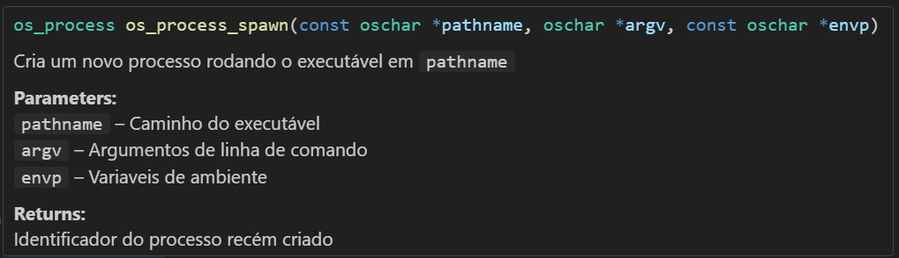

# Comentários

Em qualquer linguagem de programação, comentários são uma porção de texto, marcada de alguma forma, para que ela seja ignorada pelo compilador ou interpretador.

Na linguagem C, comentários de uma linha são feitos utilizando `//`.

Comentários assim são ideais para descrições rápidas, geralmente ao lado ou logo acima do que se deseja descrever, o ideal é que eles sejam 
usados para descrever algo que precisa de descrição ou  justificar algo fora do comum.

```c
double c = 299792458; //Velocidade da luz (m/s)

//Estou fazendo isso por que é muito mais rápido
char *dados = mapearArquivoEmMemoria("teste.txt");
```

Já comentários em bloco, em multiplas linhas, são realizados iniciando um bloco com `/*` e finalizando com `*/`.

Blocos de comentários são geralmente utilizados para descrever funções ou realizar explicações grandes antes de algo que precisa de uma justificativa maior.

```c
/*
    Desenha o texto informado na posição X e Y informada
    Fonte é o nome da fonte, este nome pode ser
    NULL caso deseje utilizar a fonte padrão do sistema
*/
void desenhaTexto(const char *texto, int x, int y, const char *fonte);

/*
    Estou utilizando criptografia aqui, mas ela é meia boca 
    porque o patrão pediu isso muito em cima e foi o que deu pra fazer
    evite fazer código novo que use criptografia antes de implementar 
    "criptografiaV2" que deve virar o novo padrão no software
*/
void *dadosCriptografados = criptografiaV1(dados);
```

Uma boa prática é usar comentários em funções seguindo um formato como [Doxygen](https://www.doxygen.nl/) ou a [Documentação em XML](https://learn.microsoft.com/en-us/cpp/build/reference/xml-documentation-visual-cpp?view=msvc-170) utilizada no Visual Studio. A ideia de usar comentários seguindo estes padrões, é que é possível gerar páginas de documentações a partir deles, assim como eles também ajudam IDEs modernas a gerarem tooltips (menus de contexto) melhores e mais completos.

Por exemplo, podemos declarar esta função utilizando comentários no formato `Doxygen` : 
```c
 /**
  * @brief Cria um novo processo rodando o executável em `pathname`
  * 
  * @param pathname Caminho do executável
  * @param argv Argumentos de linha de comando
  * @param envp Variaveis de ambiente
  * @return Identificador do processo recém criado
  */
os_process os_process_spawn(const oschar *pathname, oschar *argv, const oschar *envp);
```

Ao colocar o mouse em cima de um código que esteja utilizando a função `os_process_spawn`, a IDE `Visual Studio Code` exibe um tooltip assim : 



> É importante lembrar que comentários em excesso e/ou em lugares inapropriados podem prejudicar a legibilidade do código, mas isso também não é 
> justificativa para não comentar nada.
>
> Sempre que for fazer um código que precisa de uma justificativa, se pergunte se ele é realmente necessário e se não tem outras alternativas
> melhores, em alguns casos, pode valer apena sacrificar performance por simplicidade, já em outros, o contrário também pode ser verdade.