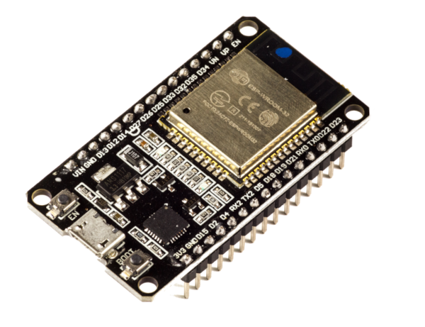

# Sistema operacional
O termo sistema operacional indica um ou mais softwares que gerenciam os recursos de software e hardware do computador, como processador, memória e periféricos.

O componente principal de um sistema operacional é o kernel, o kernel é um programa que gerencia o hardware e geralmente tem um nível de acesso superior aos programas comuns, de forma que apenas o kernel tenha acesso ao hardware e todo acesso externo por outros softwares ocorra através de solicitações ao kernel.

Solicitações para que o kernel realize tarefas, são denominadas de "chamadas de sistema" ou no inglês "syscall" (uma abreviação de "system call"), elas geralmente são necessárias para realizar tarefas que precisam de permissões elevadas, as quais, geralmente, apenas o kernel detêm.

É comum que as seguintes tarefas sejam realizadas utilizando chamadas de sistema : 
- Alocação de memória dinâmica
- Acesso ao sistema de arquivos (criar, ler, escrever, renomear arquivos, links simbólicos e pastas)
- Acesso a GPU e periféricos (mouse, teclado, USB, som, etc)
- Gerenciamento de processos e threads (criar, finalizar, monitorar, configurar, suspender)
- Comunicação via protocolos de rede 
- Comunicação entre processos
- Configuração e obtenção do tempo do sistema
- Notificações de erros de sistema
- Configuração e definição de permissões de arquivos e pastas

Dispositivos de entrada e saída (abreviados como I/O em inglês), são geralmente conectados ao barramento de endereços e podem ser controlados ao ler e escrever em endereços específicos.

Isso significa que as mesmas instruções utilizadas para ler e escrever em variáveis na memória, são também utilizadas para comunicar com dispositivos externos como placa de som, HDs, teclado, mouse, etc. Quem faz esse acesso é, no geral, o kernel ou uma aplicação bare metal. 

Sistemas operacionais são uma junção do kernel com softwares adicionais que fornecem um ambiente mais amigável para o usuário, fornecendo coisas como : 
- Terminal
- Ambiente de área de trabalho com interface gráfica
- Bibliotecas simplificadas que abstraem as chamadas de sistema
- Ferramentas e softwares prontos que realizam algumas tarefas

O interessante é que, não importa o quão alto nível uma aplicação que executa em um sistema operacional seja, é comum que ela precise executar chamadas de sistemas ou utilizar programas e funções fornecidos pelo sistema operacional para realização de diversas tarefas.

Algumas ferramentas podem ser utilizadas para monitorar chamadas de sistemas e/ou funções de bibliotecas do sistema operacional : 
- [`API Monitor`](http://www.rohitab.com/downloads) no Windows
- [`strace`](https://man7.org/linux/man-pages/man1/strace.1.html) no Linux
- [`dtrace`](https://docs.oracle.com/cd/E19253-01/820-0446/chp-intro/index.html), desenvolvidas inicalmente para Solaris, mas disponível para [`FreeBSD`](https://docs.freebsd.org/en/books/handbook/dtrace/), [`Windows`](https://learn.microsoft.com/en-us/windows-hardware/drivers/devtest/dtrace) e [`Linux`](https://github.com/dtrace4linux/linux)
- [`Crescendo`](https://github.com/SuprHackerSteve/Crescendo) para MacOs
- [`jtrace`](https://newandroidbook.com/tools/jtrace.html) para uma ferramenta similar ao `strace` para Android
- [`Introspy-Android`](https://github.com/iSECPartners/Introspy-Android) para Android
- [`hooker`](https://github.com/AndroidHooker/hooker) para Android

## Sistemas embarcados
Um sistema "embarcado" é um conjunto de hardware e software projetado para execução de uma tarefa específica em um sistema maior, para que possam ser integrados em produtos e equipamentos.

Estamos nos referindo a sistemas embarcados quando falamos dos processadores encontrados em televisões, microondas, mouse, carros, eletrodomésticos, impressoras, etc.

É comum que esses sistemas embarcados utilizem microcontroladores, que são sistemas que contêm já no chip diversos periféricos, entradas e saídas integradas, ideal para realizar o controle de motores, leitura de sensores, etc.

Sistemas embarcados ainda são uma área onde a linguagem C tem uma grande dominância no mercado, devido a sua facilidade de integração com o hardware, acesso direto ao endereçamento da máquina, performance e simplicidade. 

Um exemplo de microcontrolador é o [`ESP32`](https://www.espressif.com/en/products/socs/esp32) que contêm embutido no seu chip módulo de Wifi, Bluetooth, controladores para protocolos de comunicação com periféricos como SPI e I2C, além de geradores de sinais PWM e conversores analógico-digitais.

Imagem de um ESP32:

É comum que sistemas embarcados utilizem sistemas operacionais RTOS ou nenhum (bare metal).

## RTOS
Em sistemas embarcados é comum o uso de sistemas operacionais denominados sistemas RTOS, a sigla significa "Real Time Operating System", ou seja, sistemas operacionais de tempo real.

Esses sistemas tem um foco maior em garantir execução de tarefas que precisem de baixíssima latência e precisão de tempo na faixa dos microsegundos. 

O sistema permite gerenciamento de múltiplas tarefas paralelas que podem ter níveis de prioridade diferente, simplificando muito a implementação de determinadas aplicações.

É comum que sistemas RTOS não tenham um sistema de arquivos, nem o conceito de processos, apenas "threads", que também são chamados muitas vezes de "tasks" ("tarefas" em inglês), indicando que diferentes tarefas são executadas compartilhando um mesmo espaço de endereçamento.

Em contrapartida, sistemas operacionais convencionais são projetados para que múltiplos processos sejam executados, todos isolados e com endereçamento próprio, junto de um sistema de arquivos, porém com maior latência e menos garantias quanto a precisão de tempo para que cada processo seja "agendado" para executar.

Também é comum que sistemas RTOS permitam criação de threads privilégiados que podem acessar o hardware sem necessidade de executar chamadas de sistema, pois a transição entre a execução do kernel e a aplicação do usuário geralmente é custosa.

O sistema RTOS mais utilizado no mercado é o sistema gratuito [`FreeRTOS`](https://www.freertos.org/).

## Bare Metal
Sistemas "bare metal" não apresentam nenhum sistema operacional, isso significa que não há nenhum kernel para realizar um gerenciamento de recursos, de forma que a aplicação possa utilizar o hardware diretamente sem nenhuma limitação.

O estilo de programação comum em um sistema bare metal é um loop base onde toda atividade acontece, com eventos externos checados periódicamente e/ou utilizando interrupções de hardware.

Desenvolver o sistema em bare metal é recomendado em um dos casos : 
- O processador tem recursos extremamente limitados (cada byte importa)
- Não há necessidade de paralelizar múltiplas tarefas (caso houvesse RTOS poderia ser uma boa escolha)
- A precisão de tempo necessária é muito crítica, onde cada nanosegundo conta e uma falha pode ocasionar em um grande prejuízo