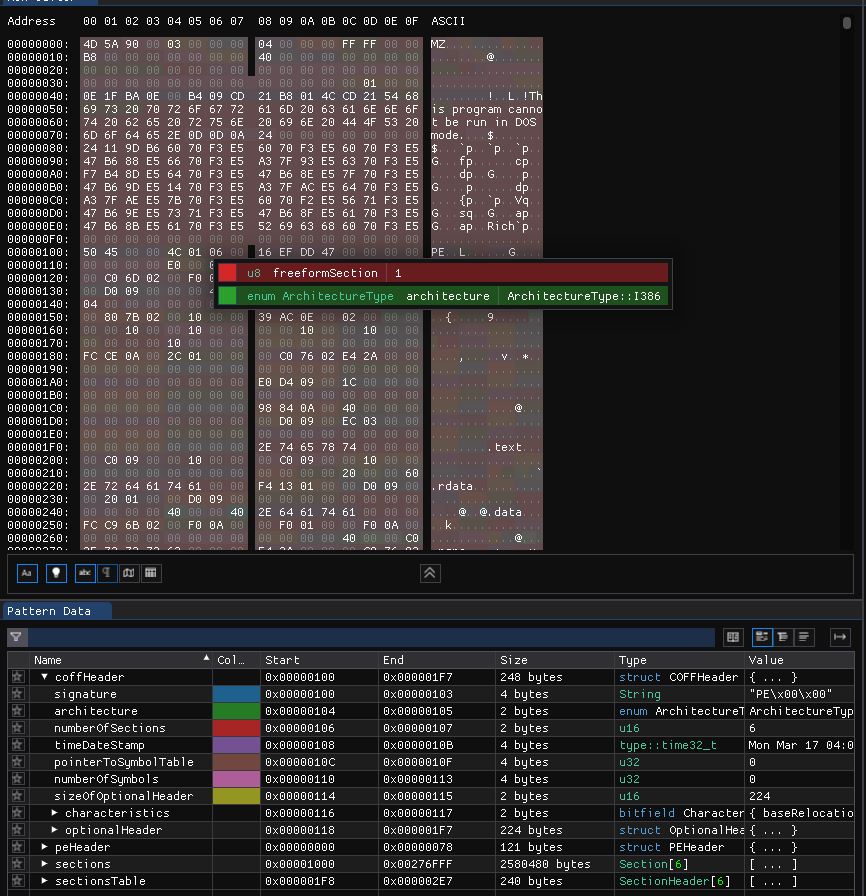

# Layout de Memória
Para compreender totalmente assuntos mais complexos como alocação de memória, é importante ter uma visão de como é organizada a memória dentro de um programa.

## Memória Virtual
Em programas executando dentro de sistemas operacionais, é comum que o uso de memória seja virtualizado, ou seja, não haja um acesso direto a memória física do sistema (no geral, a memória RAM).

A virtualização na memória permite que o sistema limite quais parcelas da memória cada processo realmente tem acesso, evitando que a instabilidade de um programa, comprometa a estabilidade do sistema inteiro.

Nesses casos, existe uma estrutura de dados denominada "tabela de páginas", que realiza a tradução de um endereço virtual para um endereço físico. 

Os valores da tabela de páginas normalmente são guardados em cache pelo processador, esse cache é denominado `TLB` (Translation Lookaside Buffer). Muitas arquiteturas modernas tem suporte direto a lidar com a tradução de páginas pelo próprio hardware, minimizando absurdamente o custo de performance ao virtualizar o acesso a memória.

O termo "mapear em memória", indica a introdução de uma nova página de memória no endereçamento virtual do processo, que o dê acesso aos dados de um arquivo, parcela da memória física ou até mesmo a um dispositivo em hardware.

A virtualização também permite que o sistema decida mapear parte do disco ou memória flash caso não haja memória RAM disponível ao alocar memória, evitando que a alocação falhe mesmo quando não há mais RAM.

Lembrando que devido ao comportamento da memória virtual, é possível que arrays que são "sequenciais na memória virtual", não sejam exatamente sequênciais na memória física.

A imagem abaixo demonstra como ocorre o acesso a memória RAM visto a tabela de páginas e endereçamento virtual :

## Código de máquina
Para entender a organização da memória, é importante compreender que código executável, o qual o processador executa, também é composto por bytes assim como dados de um programa, esse código executável em formato binário é chamado de código de máquina.

Quando compilamos um programa em C para um binário pre-compilado, geramos um arquivo executável num formato suportado pelo sistema operacional ou pelo menos os dados necessários para execução de um programa num sistema bare metal.

Nos arquivos de executáveis presentes em sistemas operacionais, temos um cabeçário com várias informações sobre o executável além dos dados para preencher as seções de memória, uma dessas seções é a que contém o código de máquina que será executado, já em sistemas bare metal, definimos como será mapeada cada região e devemos realizar parte da inicialização manualmente.

O entendimento de que código de máquina são apenas bytes também ajuda a entender algumas técnicas utilizadas por hackers como injeção ou uma adulteração de código, onde um código de máquina pode ser sobrescrito ou modificado por um programa malicioso.

O código de máquina efetivamente é composto por vários bytes contendo instruções que o processador deve executar para realizar cada tarefa, algumas dessas instruções contém uma junção de comando + dados codificados nela (como por exemplo nas instruções de pulo ou atribuição).

Uma única linha de código de C pode se tornar várias instruções da máquina que geralmente se resumem a instruções que realizam as tarefas:
- Ler/escrever dados na memória
- Operar com a "stack" (será explicado mais a frente)
- Pular para endereços
- Chamar funções
- Checar condições
- Realizar cálculos aritméticos

A quantidade de bytes e quais valores são necessários para indicar cada comando, depende da arquitetura do processador.

A linguagem assembly lida com essas diferenças pois tem comandos que correspondem diretamente as instruções do processador, sendo necessário um código diferente para cada arquitetura.

## Seções de memória 
Uma seção de memória, é uma separação lógica usada para separar código de máquina e dados, todas seções são nomeadas e seus nomes geralmente começam com `.`, cada seção tem geralmente um propósito diferente e serve como uma forma de organização dentro de um executável, alguns nomes geralmente utilizados são:

- `.text`: Utilizada para indicar código de máquina executável
- `.bss`: Utilizado para variáveis de [`duração estática`](./4-00-variaveis.md#modificadores-de-armazenamento) não inicializadas
- `.data`: Utilizada para guardar variáveis de [`duração estática`](./4-00-variaveis.md#modificadores-de-armazenamento) já inicializadas

Lembrando que a existência ou não de uma seção, depende do formato executável utilizado pelo sistema, ou pela configuração das ferramentas utilizadas para compilar o código para sistemas bare metal.

Os formatos mais utilizados são : 
- [Portable Executable](https://learn.microsoft.com/en-us/windows/win32/debug/pe-format) ou apenas `PE` usado no Windows, nomeado como `.exe` e baseado no formato `COFF`.
- [Executable and Linkable Format](https://refspecs.linuxfoundation.org/elf/elf.pdf) ou apenas `ELF`, utilizado em sistemas Linux e UNIX
- [Common Object File Format](https://wiki.osdev.org/COFF) ou apenas `COFF`, utilizado também em sistemas UNIX, mas foi em sua maioria substituido pelo formato `ELF`.
- [Mach-O](https://github.com/aidansteele/osx-abi-macho-file-format-reference), formato da Apple utilizado pelo MacOs e iOs.

Esses formatos são a forma como arquivos executáveis devem estar para que possam ser carregados pelo sistema operacional.

Uma forma interessante de aprender sobre esses formatos, é utilizar o editor hexadecimal programável [`ImHex`](https://github.com/WerWolv/ImHex), ele contém scripts automáticos que detectam o formato do arquivo modificado e marcam cada campo do arquivo com nome e cor.

A imagem abaixo demonstra sua utilização no formato executável PE do Windows:

## Segmento de memória
Enquanto as seções de memória indicam uma separação lógica dos dados e código de máquina, um segmento de memória indica, geralmente, uma separação mais voltada ao hardware.

Elas são um conjunto de características relacionadas ao hardware que seções de memória fazem parte.

As características que diferenciam segmentos de memória, no geral, são :
- Proteção de memória: permissões de leitura, escrita e execução
- Alinhamento: Podem existir diferenças quanto ao alinhamento de memória no segmento
- Barramento de memória: em algumas arquitetura podem existir barramentos diferentes de memória, pode ser necessário especificar qual deles será utilizado

Cada segmento de memória pode conter uma ou mais seções de memória, logo, podemos pensar nos segmentos como categorias e nas seções como subcategorias.

## Seções de memória conhecidas
Para entender melhor sobre as diferentes seções de memória, separamos algumas das seções de memória utilizadas separadas por propósito em cada formato de executável.

O formato COFF é considerado um formato limitado e incompleto, de forma que muitos autores tenham ido além do formato realizando extensões, por isso ele não será mencionado na tabela, visto que até o formato PE é uma extensão do formato COFF.

O formato Mach-O utiliza o prefixo `__` no lugar de `.`, para simplificar a comparação, vamos considerar os nomes como iniciando com `.` na tabela.

A coluna `PE/ELF/MACH-O` indica qual é o nome da seção em cada formato. Nos casos onde não há `/` no valor, significa que o nome da sessão é comum a todos os formatos.

| Propósito                  | Permissões       | Inicialização | PE/ELF/Mach-o                    | 
| -------------------------- | ---------------- | ------------- | -------------------------------- | 
| Código executável          | Leitura+Execução | Nenhuma       | `.text`                          |
| Globais não inicializadas  | Leitura+Escrita  | `*1`          | `.bss`                           |
| Globais inicializadas      | Leitura+Escrita  | `*2`          | `.data`                          |
| Strings constantes         | Leitura          | Nenhuma       | `.rdata`/`.rodata`/`.cstring`    |
| Globais constantes         | Leitura          | Nenhuma       | `.rdata`/`.rodata`/`.const`      |

Seções que não incluem permissão de escrita, podem ser mapeadas em memória diretamente e compartilhadas entre múltiplas instâncias do mesmo processo, diminuindo o uso de memória.

No caso de sistemas bare metal, a maioria tem acesso direto a memória flash e não precisam realizar uma cópia de dados constantes para a RAM, mas essa cópia pode ser útil em alguns casos pois o acesso a RAM é geralmente muito mais rápido.

As inicializações de variáveis globais geralmente são realizadas por uma das três opções:
- Pelo sistema operacional ao carregar um executável
- Pela biblioteca padrão do C antes da inicialização da função `main` 
- Por um código de inicialização próprio em sistemas bare metal

1. Uma região com variáveis não inicializadas é preparada ao reservar memória para a região e preenché-la com zeros, a vantagem é que essas variáveis não ocupam espaço no arquivo do executável ou memória flash/magnética do dispositivo.

2. Uma região com variáveis inicializadas é preparada reservando memória para a região e copiando o conteúdo no arquivo executável ou memória flash/magnética para essa região.

## Stack
Cada thread tem uma região de memória reservada como "Stack", que no português seria uma "Pilha", utilizada para variáveis locais, de [`duração automática`](./4-00-variaveis.md#modificadores-de-armazenamento).

Pilhas normalmente funcionam como uma lista no formato LIFO (Last In, First Out) que no português seria "Último a entrar, primeiro a sair", onde variáveis são empilhadas no topo e posteriormente removidas.

A motivação da stack é ter uma memória temporária, de acesso rápido, já pre-alocada, na qual o processador pode acessar rapidamente e possívelmente manter em cache para realizar tarefas que não precisem de persistência nos dados.

Várias arquiteturas tem um registrador dedicado chamado de "Stack Pointer" (ou `SP`) que aponta para a posição atual da stack, junto de várias instruções que adicionam, leem ou removem elementos dela.

Além do Stack Pointer, é comum que exista um registrador como "Frame Pointer", que aponta para o início das variáveis locais de uma função e simplifica o acesso a variáveis locais, além disso, o endereço de retorno para "voltar ao mesmo ponto de execução" após a execução de uma função, geralmente é guardado também na stack.

Chamamos de "Stack Frame" o conjunto das variáveis locais, endereço de retorno e parâmetros de funções presentes na stack.

A imagem abaixo demonstra a organização da memória na stack ao chamar funções : 

Nas arquiteturas modernas, a conveção mais utilizada é que a stack cresce para baixo, ou seja, decrementamos o endereço do Stack Pointer para adicionar novos elementos, porém isso não é padronizado e existem também arquiteturas onde a stack cresce para cima.

É muito comum que funções "avançem" o stack pointer ao adicionar váriaveis novas e simplesmente "recuem" o stack pointer durante a finalização para liberar todas as variáveis locais da função em uma única operação, tornando a operação da stack extremamente eficiente.

Isso também explica porque variáveis locais tendem a ter valores "aleatórios" caso não sejam inicializadas, a tendência é que elas tenham o último valor que foi colocado naquele endereço da stack.

No sistema operacional Windows, é normal que o tamanho máximo da Stack seja de 1MB, enquanto no linux e MacOs seja de 8MB.

Exceder o limite de tamanho da stack implica num erro que chamamos de "stack overflow", que normalmente leva o programa a ser finalizado pelo sistema operacional, é comum que esse erro aconteça ao lidar com funções recursivas.

## Heap
A heap é como chamamos a região de memória onde guardamos variáveis alocadas dinâmicamente, assunto que será tratado com mais detalhes no próximo capítulo.

Toda memória da heap deve ser acessada indiretamente via ponteiro, pois não há como saber com antecedência qual será o endereço recebido ao alocar memória, ela também deve ser "liberada" manualmente, de forma que a memória possa ser reutilizada por outros processos ou em novas alocações.

No linux, por exemplo, é comum que as regiões `.bss`, `.data` e a heap, façam parte do segmento `data`, que compoem um segmento com permissões de leitura e escrita.

A função padrão do C para alocação, `malloc` é implementada pela GLIBC (biblioteca padrão do C pelo projeto GNU) no linux usando duas funções do sistema dependendo do tamanho da alocação :

- Para alocações menores que 128KB, utiliza-se a função de sistema [`brk`](https://man7.org/linux/man-pages/man2/brk.2.html), que modifica onde é o fim do segmento `data`, o que acaba por alocar ou desalocar memória, utilizar essa função manualmente pode causar conflito com `malloc`, portanto recomenda-se evitar seu uso por código do usuário.
- Para alocações maiores que 128kb, a GLIBC utiliza a função [`mmap`](https://man7.org/linux/man-pages/man2/mmap.2.html), que mapeia uma nova região de memória separada do segmento `data`, mas que funciona de forma independente, e pode ser desalocada de forma individual.

A vantagem de `brk` sobre `mmap` é que ela é mais rápida, porém vem com diversas desvantagens:
- As alocações "expandem" o segmento `data`, se houver outra coisa mapeada no caminho que impeça o segmento de crescer, `mmap` se tornará a única forma de alocar memória
- Ela não é amigável para código multithread, pois toda alocação de memória deve ser gerenciada de forma unificada
- A necessidade de unificar o gerenciamento de memória dificulta a presença de outros alocadores e pode conflitar com outras bibliotecas

## Bibliotecas de Vínculo Dinâmico
Existem algumas bibliotecas especiais chamadas de bibliotecas de vínculo dinâmica, são efetivamente arquivos executáveis "especiais", que podem ser carregados para dentro de outros executáveis.

O formato de arquivo utilizado em cada uma dessas bibliotecas, ainda é o mesmo formato utilizado por executáveis na mesma plataforma, porém com valores diferentes nos cabeçários do arquivo.

As extensões utilizadas em cada sistema é : 
- `.dll` (Dynamic Link Library) para bibliotecas de vínculo dinâmico no formato `PE` no windows.
- `.so` (Shared Object) para bibliotecas de vínculo dinâmico no formato `ELF` no linux e outros sistemas UNIX.
- `.dylib` (Dynamic Library) para bibliotecas de vínculo dinâmico no formato `Mach-O` no macOs e iOs.

As bibliotecas de vínculo dinâmico geralmente podem ser carregadas de uma das seguintes formas : 
- Adicionando a função na tabela de importação no cabeçário do executável (torna a biblioteca uma depedência para que o executável funcione)
- Carregando a biblioteca durante tempo de execução utilizando alguma função do sistema operacional

Em alguns casos, existem bibliotecas estáticas, que podem ser vinculadas junto com o executável, que já adicionam os dados necessários na tabela de importação do executável, simplificando o processo de importar as bibliotecas.

Adicionar funções na tabela de importação pode não ser uma boa idéia se não houver uma garantia maior de que a biblioteca existe, pois uma falha em carregar a biblioteca resultará em uma falha em executar o programa.

Nesses casos, carregar a biblitoeca durante tempo de execução pode ser uma opção melhor, para isso, são utilizadas as funções : 

| Ação                    | Windows          | Linux/Android | macOs/iOs | 
| :---------------------: | :--------------: | :-----------: | :-------: |
| Carregar uma biblioteca | [`LoadLibraryW`](https://learn.microsoft.com/en-us/windows/win32/api/libloaderapi/nf-libloaderapi-loadlibraryw)  | [`dlopen`](https://man7.org/linux/man-pages/man3/dlopen.3.html)      | [`dlopen`](https://developer.apple.com/library/archive/documentation/System/Conceptual/ManPages_iPhoneOS/man3/dlopen.3.html)  |
| Procurar um símbolo     | [`GetProcAddress`](https://learn.microsoft.com/en-us/windows/win32/api/libloaderapi/nf-libloaderapi-getprocaddress) | [`dlsym`](https://man7.org/linux/man-pages/man3/dlsym.3.html)       | [`dlsym`](https://developer.apple.com/library/archive/documentation/System/Conceptual/ManPages_iPhoneOS/man3/dlsym.3.html)   |
| Descarregar biblitoeca  | [`FreeLibrary`](https://learn.microsoft.com/en-us/windows/win32/api/libloaderapi/nf-libloaderapi-freelibrary)    | [`dlclose`](https://man7.org/linux/man-pages/man3/dlclose.3.html)     | [`dlclose`](https://developer.apple.com/library/archive/documentation/System/Conceptual/ManPages_iPhoneOS/man3/dlclose.3.html) |

Uma das grandes "vantagens" de bibliotecas de vínculo dinâmico, é que múltiplos processos podem "reutilizar" a mesma biblioteca, minimizando o uso de memória e evitando a presença de múltiplas cópias "do mesmo código". 

É muito comum que a biblioteca padrão do C seja distribuida como uma biblioteca de vínculo dinâmico, o que permite que ela seja atualizada e vulnerabilidades nela sejam corrigidas, sem exigir uma recompilação de todos os programas do sistema inteiro.

### Bibliotecas dinâmicas na memória
As bibliotecas dinâmicas fazem parte do layout da memória da maioria dos processos em um sistema operacional moderno, como cada uma delas é um executável embarcado, cada biblioteca tem suas próprias seções de memória.

Na figura abaixo, retirada do programa [`x64Dbg`](https://x64dbg.com/) (debugger e patcher de assembly para engenharia reversa), podemos ver as seções de memória de algumas DLLs carregadas em um processo : 

### Tabela de importação
Para os casos onde as bibliotecas de vínculo dinâmico são carregadas durante a inicialização do programa, elas precisam ser referenciadas na tabela de importação do executável.

A tabela de importação contém uma lista com os nomes das bibliotecas e os nomes das funções que devem ser importadas, bem como uma lista de endereços que serão preenchidos pelo sistema operacional com os endereços das funções carregadas.

Não há garantia quanto ao endereço em que uma biblioteca dinâmica será carregada muito menos que ela continue com o mesmo tamanho em versões posteriores. 

Portanto, as funções de bibliotecas dinâmicas precisam ser chamadas de forma indireta, utilizando os ponteiros de função preenchidos na tabela de importação, tudo isso é feito de forma transparente para o programador em C.

A imagem abaixo demonstra algumas funções importadas de bibliotecas dinâmicas em um executável visualizadas no [`x64Dbg`](https://x64dbg.com/):

Os endereços a esquerda são os endereços base de cada módulo, enquanto os endereços a direita são os endereços de cada ponteiro de função que referencia uma função importada.

## Visão Geral
Podemos dizer que no geral, um programa geralmente tem uma stack, heap e as regiões `.bss`, `.data`, `.text` e alguma das regiões para constantes globais.

Uma visão geral de como funciona o layout de memória num processo no linux pode ser visto na figura abaixo, com as setas indicando para qual direção a heap e stack crescem, lembrando que a imagem não leva em consideração páginas adicionais alocadas via `mmap`:

