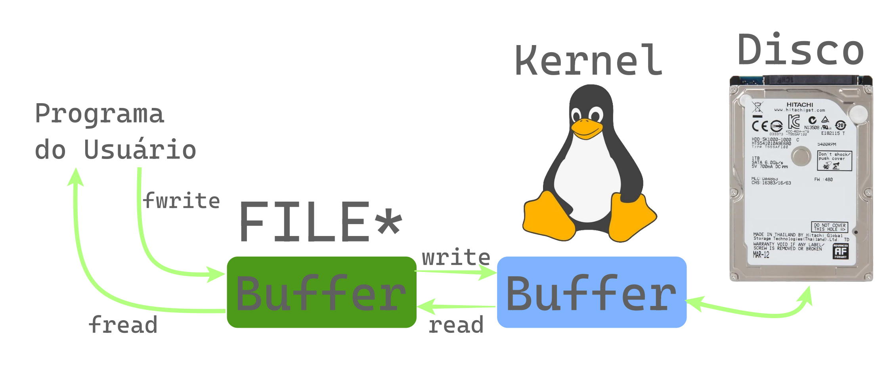

# Arquivos
Para este capítulo, assume-se que o leitor tenha conhecimento básico sobre o [terminal, além da saída e entrada padrão](./x-03-terminal.md).

Um arquivo é uma coleção de dados ou informações vinculados a um nome.

É normal que arquivos estejam separados em pastas (também chamados de diretórios), pastas são usadas para agrupar e armazenar arquivos e/ou outras pasta, sendo também referenciadas por nome.

A junção de arquivos e pastas forma um sistema hierárquico agrupado por pastas, denominado de sistema de arquivos, que deve ser implementado devido a natureza linear dos dispositivos de armazenamento.

Como os sistemas devem ser implementados, geralmente via software, a implementação e forma como os dados são representados dentro de um dispositivo de armazenamento definem o formato do sistema de arquivos, alguns formatos conhecidos são `NTFS`, `APFS`, `ext4`, `exFat`, `FAT32`, etc.

Cada formato de sistema de arquivos fornece diferentes capacidades, otimizações, funcionalidades e metadados.

Metadados são informações sobre um arquivo ou dado, alguns sistemas de arquivo tem suporte a metadados de arquivos como datas de modificação, data de criação e data de último acesso, entre outros.

## Diferenças entre sistemas operacionais
Uma das grandes diferenças entre os sistemas que seguem a especificação POSIX (Linux, macOs, FreeBSD e afins) e o Windows é o tipo de caractere utiilizado.

O Windows utiliza internamente UTF-16 para strings e todos compiladores no Windows históricamente utilizam `wchar_t` como UTF-16, podemos dizer que as funções do Windows internamente aceitam o tipo `wchar_t` e não `char`, portanto toda função que interage com o sistema de arquivos utilizando `char` deve internamente realizar conversões para  `wchar_t`.

O problema dessa diferença do Windows é que se a localidade não for corretamente configurada com a função `setlocale`, podemos ter problemas ao lidar com arquivos que contêm caracteres especiais como acentuações, emojis, etc. Isso piora ainda mais quando percebemos que o suporte ao encoding UTF-8 utilizando `setlocale` só surgiu no Windows 10 com o ambiente de execução UCRT.

Já sistemas POSIX normalmente utilizam UTF-8 e `char`, facilitando bastante a integração com a linguagem C.

Um detalhe adicional é que, os kernels de sistemas POSIX e Windows, no geral, não realizam uma validação das strings para verificar se são UTF-8 ou UTF-16 válido, todas strings são meramente tratadas como dados genéricos e, no geral, apenas os caracteres separadores de pastas (`/` no POSIX, `\` no Windows) tem um tratamento especial, portanto existe a possibilidade dos nomes de arquivos e pastas conterem UTF-8 ou UTF-16 malformado, esse detalhe nos leva a classificar os formatos utilizados como [WTF-8](https://wtf-8.codeberg.page/) e [WTF-16](https://www.riskpath.co.uk/presentations/WTF-WindowsFileSystem.pdf). 


Para testar se a conversão funciona propriamente no Windows, crie um arquivo chamado `😀.txt` e teste o código abaixo:

```c
#include <stdio.h>
#include <locale.h>

int main()
{
    setlocale(LC_ALL, "portuguese.utf8");
    rename("😀.txt", "👀.txt");
}
``` 

Caso o arquivo não seja renomeado para `👀.txt`, significa que o ambiente de execução do C utilizado não suporta `utf-8`, a alternativa a isso é utilizar diretamente as funções do sistema no Windows, que aceitam strings em UTF-16 diretamente.

## Arquivos em C
A biblioteca `stdio.h` fornece algumas funções que podemos utilizar para interagir com o sistema de arquivos de forma portável em C.

Um arquivo em C normalmente é descrito pelo tipo `FILE*`, que é um ponteiro para um tipo de dado que pode ser diferente em cada sistema operacional ou ambiente, sendo aconselhável que o usuário evite acessar diretamente seus campos e prefira utilizar funções para operar com o `FILE*`.

O tipo `FILE*` descreve um "fluxo de bytes", ou no inglês "byte stream", ele é chamado de fluxo pois indica um fluxo para escrita e/ou leitura de bytes, onde cada operação de leitura ou escrita avança a posição no fluxo que também pode ser chamado de "posição do arquivo".

A ideia de utilizar um fluxo de arquivos para ler um arquivo "aos poucos", também permite que seja possível ler de arquivos com gigabytes de tamanho sem consumir muita memória, lendo pequenos pedaços por vez e processando os dados conforme são lidos.

Um `FILE*` é composto de : 
1. Largura de caracteres: não definido, normal ou wide
2. Estado de conversão, para conversão entre caracteres de múltiplos bytes e o tipo `wchar_t`
3. Estado de bufferização: sem bufferização, bufferização por linha ou bufferização completa
4. O buffer, que pode ter seu tamanho modificado ou trocado por um externo, utilizando a função `setvbuf`
5. Permissões: leitura, escrita ou ambos
6. Indicador de modo binário/texto
7. Indicador de fim de arquivo
8. Indicador de erro
9. Indicador de posição do arquivo
10. Desde o `C11`, travas que evitam condições de corrida quando múltiplos threads lêem, escrevem ou modificam/lêem a posição do arquivo

A tabela a seguir demonstra as funções disponíveis e sua respectiva funcionalidade: 

| Função            | Descrição                                                               |
| :---------------: | :---------------------------------------------------------------------: |
| fopen             | Abre ou cria um arquivo                                                 |  
| fread             | Lê do arquivo                                                           |
| fwrite            | Escreve no arquivo                                                      |
| freopen           | Abre ou cria um arquivo sobrescrevendo um `FILE*` existente             |
| fclose            | Fecha um arquivo                                                        |
| fflush            | Força escrita de dados pendentes                                        |
| setbuf            | Muda o buffer interno usado no arquivo                                  |
| setvbuf           | Modifica buffer interno e/ou tipo de buferização e/ou tamanho do buffer |
| ftell             | Retorna a posição atual do arquivo                                      |
| fseek             | Modifica a posição do arquivo                                           |
| rewind            | Volta o arquivo para a posição 0 e remove status de erro                |
| fgetpos           | Retorna posição do arquivo + estado de decodificação                    |
| fsetpos           | Restaura uma posição de arquivo obtida com `fgetpos`                    |
| fwide             | Define a largura de caracteres do arquivo                               |
| clearerr          | Limpa os últimos erros do arquivo                                       |
| feof              | Checa se o arquivo acabou                                               |
| ferror            | Checa se ocorreu um erro no arquivo                                     |
| remove            | Apaga um arquivo                                                        |
| rename            | Renomeia um arquivo                                                     |
| tmpfile           | Abre um arquivo temporário no modo `wb+`                                |
| tmpnam            | Gera um nome único que pode ser utilizado para criar um arquivo         |

A função `remove` tem um comportamento inconsistente entre o sistema operacional Windows e sistemas POSIX, no Windows a função pode excluir apenas arquivos, sendo necessário utilizar [`RemoveDirectoryW`](https://learn.microsoft.com/en-us/windows/win32/api/fileapi/nf-fileapi-removedirectoryw) para apagar pastas no Windows.

A função `rename` pode ser utilizada para renomear ou mover arquivos, em sistemas POSIX o comportamento padrão é que a função pode sobrescrever arquivos existentes enquanto no Windows a função falha quando isso ocorre, é possível obter um comportamento mais consistente utilizando [`renameat2`](https://man7.org/linux/man-pages/man2/rename.2.html) no Linux e [`MoveFileExW`](https://learn.microsoft.com/en-us/windows/win32/api/winbase/nf-winbase-movefileexw) no Windows onde a opção de sobrescrever ou não arquivos é controlada por flags.

### Modo e permissões
Ao abrir um arquivo utilizando a função `fopen`, podemos definir os modos e permissões utlizando o segundo parâmetro que é uma string.

| String | Descrição                         | Se existente     | Se não existe  |
| :----: | :-------------------------------: | :--------------: | :------------: |
| r      | Abre arquivo para leitura         | Lê do inicio     | Falha ao abrir |
| w      | Cria arquivo para escrita         | Destroi conteúdo | Cria novo      |
| a      | Abre arquivo para adição          | Escreve no fim   | Cria novo      |
| r+     | Abre arquivo para leitura/escrita | Lê do inicio     | Erro           |
| w+     | Cria arquivo para leitura/escrita | Destroi conteúdo | Cria novo      |
| a+     | Abre arquivo para leitura/escrita | Escreve no fim   | Cria novo      |

Um arquivo aberto para "adição" tem todas as suas escritas efetuadas na última posição de arquivo, isto é, não é possível modificar o conteúdo antigo do arquivo,
mas podemos adicionar mais dados a ele.

Os seguintes modificadores podem ser utilizados em conjunto com as strings da tabela acima:
- `b`: Não tem efeito nos sistemas POSIX, mas no Windows define o arquivo como modo binário
- `x`: Adicionado no `C11`, só pode ser usado junto de `w` ou `w+` (`wx` ou `wx+`), faz com que a função falhe se o arquivo já existe.

Quanto a diferença de modo texto e modo binário, em sistemas POSIX como MacOs e Linux, não há diferença, mas no Windows, como o padrão utilizado como terminador de linha é `\r\n` enquanto que o padrão definido pela linguagem C é apenas `\n`, o sistema realiza conversões automáticas de `\r\n` para `\n` durante a leitura, e de `\n` para `\r\n` durante a escrita.

Essa conversão automática pode causar efeitos catastróficos ao lidar com arquivos binários (corrompendo arquivos, lendo dados de forma incorreta), portanto o modo que a desabilita é chamado de "modo binário" e um `FILE*` sem `b` no Windows é normalmente descrito como operando em "modo texto".

### Largura de caracteres 
A largura de caracteres é inicialmente não definida, permitindo uso das funções wide e normais, quando definimos a largura de caracteres, estamos limitando o arquivo a operar com somente um dos dois conjuntos de funções.

A configuração "wide" também força todas as leituras a converterem a entrada de caracteres de múltiplos bytes para `wchar_t` e a saída de `wchar_t` para o formato de múltiplos bytes.

A tabela a seguir demonstra as funções de leitura e escrita vinculadas a largura de caracteres : 
| Normal            | Wide              | Descrição                                         |
| :---------------: | :---------------: | :-----------------------------------------------: |
| fgetc             | fgetwc            | Lê um caractere                                   |  
| fgets             | fgetws            | Lê uma string                                     |
| fputc             | fputwc            | Escreve um caractere                              |
| fputs             | fputws            | Escreve uma string                                |
| getchar           | getwchar          | Lê um caractere da `stdin`                        |
| gets              | Nenhuma           | Lê uma string da `stdin`                          |
| putchar           | putwchar          | Escreve um caractere na `stdout`                  |
| puts              | Nenhuma           | Escreve uma string na `stdout` + `'\n'`           |
| ungetc            | ungetwc           | Coloca um caractere de volta no fluxo de arquivo  |

Lembrando que a função `gets` é tão problemática que é literalmente impossível utilizá-la de forma segura, portanto no `C11` ela foi removida da linguagem, aconselha-se utilizar `fgets` no seu lugar.

Toda função que atua com `stdin` ou `stdout` pode também ser substituida por sua versão que atua com um `FILE*` genérico, pois `stdin`,`stdout` e `stderr` são macros que resultam em um `FILE*`.

### Bufferização

As operações realizadas no `FILE*` também são bufferizadas, isto é, ao ler ou escrever no arquivo, os dados são inicialmente guardadas em um buffer, um array alocado dinâmicamente ao abrir o arquivo, e posteriormente são repassadas a função nativa do sistema operacional que realmente realiza a operação.

Essa bufferização ocorre pois escrever ou ler um número pequeno de bytes múltiplas vezes é ineficiente, leituras e escritas com tamanhos maiores como 64KB ou 128KB por vez são geralmente mais eficientes em hardware moderno.

Dessa forma, cada vez que escrevemos em um arquivo bufferizado, os dados escritos são na verdade copiados ao buffer de escrita e quando este buffer chega no tamanho ideal para uma escrita eficiente, ele é efetivamente escrito utilizando a função nativa do sistema para tal.

Da mesma forma, cada vez que realizamos uma leitura de qualquer valor num arquivo bufferizado, os dados são copiados do buffer de leitura para o ponteiro do usuário, caso não haja mais dados remanescentes, uma leitura com o tamanho ideal para eficiência é realizada e os bytes lidos podem ser utilizados nas leituras seguintes.

Lembrando que é comum que o tamanho do buffer definido pela biblioteca padrão não seja ajustado para maximizar a performance, nestes casos, isso pode ser resolvido com uma chamada para a função `setvbuf` onde é possível definir manualmente o tamanho do buffer, o tipo de buferização e/ou opcionalmente fornecer um buffer do usuário que será usado no lugar do buffer interno.

Existem 3 tipos de buferrização que podem ser definidos com `setvbuf`:
- Sem bufferização: Não há bufferização, toda chamada de `fread`/`fwrite` e afins resulta diretamente em uma chamada do sistema.
- Bufferização de linha: Ao escrever, quando o caractere `\n` é encontrado, a saída é escrita imediatamente, é comum que a saída padrão `stdout` tenha esse tipo de bufferização.
- Bufferização completa: Os dados só são escritos quando o buffer interno está cheio, `fflush` é chamado ou `fclose` é chamado.

Também é comum que muitos sistemas operacionais realizem a bufferização de escritas antes de repassá-las ao dispositivo de armazenamento, pois escrever na memória RAM é geralmente muito mais rápido. Uma escrita que já foi enviada ao sistema operacional geralmente já permite que outros programas possam ler o valor atualizado, mas não significa que os dados realmente foram gravados no dispositivo de armazenamento.

A bufferização de escritas pelo sistema operacional é o principal motivo pelo qual "desligar o PC da tomada" não é aconselhável, justamente pelo fato de que arquivos podem ser corrompidos durante o processo.

Esse comportamento abre portas para um possível problema: perder arquivos que visivelmente eram acessíveis, mas que na verdade nunca foram salvos no disco efetivamente.

A imagem abaixo demonstra de forma visual a bufferização e o papel do sistema operacional:




A função `fflush` pode ser utilizada para forçar uma escrita de todos dados pendentes no buffer, lembrando que ela força a escrita para o sistema operacional, para forçar o sistema operacional a realizar a escrita para o dispositivo de armazenamento, processo normalmente chamado de sincronização, é necessário utilizar funções como [`FlushFileBuffers`](https://learn.microsoft.com/en-us/windows/win32/api/fileapi/nf-fileapi-flushfilebuffers) do Windows ou [`fsync`](https://man7.org/linux/man-pages/man2/fsync.2.html) do POSIX (Linux,macOs,etc).

Para realizar a sincronização de todos arquivos em um disco, utilizamos a função `syncfs` nos sistemas UNIX e a própria `FlushFileBuffers` passando um arquivo de dispositivo de um disco/SSD aberto como parâmetro (sendo necessário permissão de administrador para abrir um disco como arquivo no Windows).

Também é comum que iniciantes erroneamente usem `fflush` para limpar a entrada ao realizar leituras pelo terminal, apesar de funcionar em alguns sistemas, isso está fora da especificação oficial do C, que cita que o `fflush` funciona apenas para arquivos abertos para escrita.

### Segurança em Threads
Desde o `C11`, para que o `FILE*` possa ser utilizado de forma segura em múltiplos threads, as funções que operam com o `FILE*` incluem "travas" que bloqueiam que outros threads operem com o `FILE*` até que a operação finalize.

O uso de travas para segurança em múltiplos threads diminui a performance, mas mantêm um comportamento consistente e seguro quando mais de um thread utiliza o mesmo arquivo.

Seguindo o padrão do C, não existe nenhuma função "padronizada" que possa evitar as travas para melhorar a performance, porém, várias implementações da biblioteca padrão que fornecem funções que realizam essas tarefas como extensão, o que acontece nos sistemas POSIX e no Windows.

Na biblioteca padrão do C do Windows, foram introduzidas funções com o prefixo `_` e sufixo [`_nolock`](https://learn.microsoft.com/en-us/cpp/c-runtime-library/nolock-functions?view=msvc-170), logo para função `fread` existe a `_fread_nolock`, lembrando que essas funções só estão disponíveis no UCRT no Windows.

Para sistemas POSIX, temos as funções com sufixo [`_unlocked`](https://man7.org/linux/man-pages/man3/unlocked_stdio.3.html), logo para função `fread`, existe a `fread_unlocked`, inclusive existem as funções `flockfile`, `ftrylockfile` e `funlockfile` que permitem que a trava seja acionada/desacionada manualmente pelo usuário, permitindo que múltiplas funções `_unlocked` sejam chamadas de forma segura para mais de um thread sem o custo de acionar e desacionar a trava a cada chamada.

Na documentação da Microsoft há uma menção indicando que utilizar [`_configthreadlocale`](https://learn.microsoft.com/en-us/cpp/c-runtime-library/reference/configthreadlocale?view=msvc-170) para que a localidade do thread seja desvinculada do localidade global evita travas que são utilizadas para acessar informações de locale (como ocorre com funções da familia `printf` e `scanf`), agilizando o desempenho, ao desvincular a localidade, podemos usar a própria `setlocale` para configuração.

Já em sistemas POSIX, é normal que exista a função [`uselocale`](https://man7.org/linux/man-pages/man3/uselocale.3.html) que permite definir uma localidade separada da global definida com `setlocale`, a localidade deve ser definida utilizando a função [`newlocale`](https://man7.org/linux/man-pages/man3/newlocale.3.html) ou [`duplocale`](https://man7.org/linux/man-pages/man3/duplocale.3.html), mas não há nenhuma menção de que a biblioteca padrão use ou possa usar travas para ler os dados da localidade atual.

Podemos utilizar a biblioteca feita pelo autor deste guia para uso portável das funções sem trava utilizando o sufixo `_unlocked`: <a href="./libs/stdio_unlocked.h" download>stdio_unlocked.h</a>.

## Leitura de dados formatados
A familia de funções [`scanf`](https://en.cppreference.com/w/c/io/fscanf.html) apresenta várias variantes como `fscanf`, `sscanf`, `vscanf`, `vfscanf`, `vsscanf`, `wscanf`, `fwscanf`, `swscanf`, `vwscanf`, `vfwscanf`, e `vswscanf`.

Os prefixos antes da palavra `scanf` nas funções indicam:
- `f`: Indica que a função lê de um `FILE*`, quando o prefixo não está presente, significa que ela utiliza a `stdin` (Entrada padrão)
- `s`: Indica que a função lê de uma string na memória ao invés de um `FILE*`
- `w`: Indica que a função lê uma entrada no formato `wchar_t` ao invés de `char`
- `v`: Indica que a função aceita um `va_list`

Todas as funções aceitam um parâmetro de `formato` e um número variáveis de argumentos ou `va_list` com os endereços dos parâmetros que serão preenchidos pela função, a ideia das funções de `scan` é extrair dados de uma string ou arquivo de texto num formato qualquer.

Os dados só são extraidos se o padrão colocado no formato bate com o padrão no texto lido/fornecido, de forma que as funções de `scan` funcionem como um [Regex](https://blog.dp6.com.br/regex-o-guia-essencial-das-express%C3%B5es-regulares-2fc1df38a481) mais primitivo. Se algum caractere/formato não bater, a função falha imediatamente e mantêm o que não foi consumido como pendente no buffer de leitura (caso esteja lendo de um arquivo).

Na string de formato, ao adicionar um único caractere que é determinado como "espaço em branco" pela função `isspace`, todos os caracteres que são "espaço em branco" são pulados até que seja encontrado um caractere que não é um "espaço em branco", a lista de caracteres que se encaixam nessa categoria são : 
- Espaço (` `, 0x20)
- Form feed (`\f`, 0x0C)
- Line feed (`\n`, 0x0A)
- Carriage return (`\r`, 0x0D)
- Tab horizontal (`\t`, 0x09)
- Tab vertical (`\v`, 0x0B)

Todo especificador de formato é composto, na seguinte ordem, por:
- Caractere `%` inicial
- `(Opcional)` o caractere `*` que suprime a atribuição, de forma que o especificador seja utilizado apenas para "pular" o padrão especificado
- `(Opcional)` um número inteiro maior que 0, chamado de especificador de tamanho, que especifica o número de caracteres máximo que serão lidos, lembrando que `%s` e `%[` podem facilmente levar a um overflow de buffer sem este argumento.
- `(Opcional)` modificador de tamanho para o tipo, que indica o tipo de destino usado na conversão.
- O especificador do formato de conversão

Os modificadores de tamanho de tipo aceitos são : 
- Para strings e caracteres:
    - `nenhum` = `char*`
    - `l` = `wchar_t*`
- Para inteiros:
    - `hh` = `unsigned char*` ou `signed char*`
    - `h`  = `unsigned short*` ou `short*`
    - `nenhum` = `unsigned int*` ou `int*`
    - `l` = `unsigned long*` ou `long*`
    - `ll` = `unsigned long long*` ou `long long*`
    - `j` = `uintmax_t*` ou `intmax_t*`
    - `z` = `size_t*`
    - `t` = `ptrdiff_t*`
    - `wN` = Onde `N` é o número de bits, aceita `uintN_t*`, `intN_t*` ou `_BitInt(N)` (`C23`)
- Para ponto flutuante:
    - `nenhum` = `float*`
    - `l` = `double`
    - `L` = `long double`
    - `H` = `_Decimal32` (`C23`)
    - `D` = `_Decimal64` (`C23`)
    - `DD`= `_Decimal128` (`C23`)

Os especificadores de formato de conversão existentes são : 
- `%`: Consome um `%` 
- `c`: Consome e atribui `N` caracteres, onde `N` é o número do especificador de tamanho ou 1 caso ele não seja informado, lembrando que esse especificador não atribui um `\0`, pode consumir e atribuir "espaço em branco"
- `s`: Consome e atribui uma string, parando quando um caractere de "espaço em branco" é encontrado ou a quantidade de caracteres consumidos excederia o número do especificador de tamanho (caso ele seja informado), 
adiciona um `\0` no final, de forma que o buffer fornecido precise ter ao menos `N+1` onde `N` é o especificador de tamanho.
- `[set]`: Consome e atribui o conjunto de caracteres presentes em `set`, se o primeiro caractere presente no `set` for `^` então consome e atribui todos caracteres NÃO PRESENTES no `set`. Assim como no especificador `s` adiciona um `\0` no final, algumas implementações também permitem que uma faixa seja informada, utilizando `A-Z` por exemplo para todos caracteres do valor ASCII de `A` até `Z`.
- `d`: Consome e atribui um inteiro decimal, de forma similar a `strtol` com `10` no parâmetro `base`.
- `i`: Consome e atribui um inteiro qualquer, onde o formato é deduzido pela entrada ao ler, de forma similar a `strtol` com `0` no parâmetro `base`.
- `u`: Consome e atribui um inteiro sem sinal decimal, similar a `strtoul` com `10` no parâmetro `base`.
- `o`: Consome e atribui um inteiro octal sem sinal, similar a `strtoul` com `8` no parâmetro `base`.
- `x` ou `X`: Consome e atribui um inteiro hexadecimal sem sinal, similar a `strtoul` com 16 no parâmetro `base`.
- `n`: Atribui o número de caracteres lidos até agora, nenhuma entrada é consumida.
- `a`, `e`, `f` ou `g` : Consome e atribui um ponto flutuante com sinal, a entrada também pode ser infinito ou NAN, o formato é o mesmo aceito pela função `strtof`. 
- `p`: Consome e atribui uma sequência definida pela implementação, que identifica um ponteiro, o argumento atribuido deve ser do tipo `void**`.

Todos os especificadores de formato, exceto `[set]`, `c` e `n`, consomem todos os caracteres de "espaço em branco" antes de ler a entrada e realizar o consumo e atribuição do respectivo especificador de formato.

Todas funções da familia `scanf`, retornam o número de conversões bem sucedidas, sendo possível detectar se a função falhou ou não ao compararmos o número de conversões esperadas com o número recebido, além disso a função pode retornar `EOF` caso ocorra um erro ao ler do arquivo antes de uma conversão ocorrer com sucesso.

O código abaixo demonstra alguns exemplos utilizando `sscanf` para extrair dados de strings:
```c
//1. Obter nome, idade e formação
char nome[65];
int idade;
char formacao[65];

sscanf("Meu nome é Agatha, tenho 25 anos e sou formada em Psicologia", 
       "Meu nome é %64s, tenho %d anos e sou formada em %64s", 
       nome, &idade, formacao);

//2. Obter o nome de um arquivo executável
char executavel[256];
sscanf("MeuPrograma.exe", "%255[^.].exe", executavel);
```

As funções da familia `scanf` são úteis nos casos onde temos garantias quanto a forma como os dados são organizados para que sejam extraidos de forma simples, nesses casos a função permite a extração de dados de padrões mais complexos com relativamente pouco código.

Porém casos como leitura de dados de usuário onde a ordenação ou formato dos dados não necessariamente segue um padrão ou está sempre correta, as funções de `scan` podem não ser ideais, nesses casos as funções que lêem de strings como `sscanf` ainda podem ser úteis, porém, utilizar diretamente funções como `strtol`, `strtod` e similares pode, muitas vezes, ser mais eficiente e permitir um tratamento de erros melhor.

Muitos iniciantes também tem problemas ao utilizar `scanf` diretamente para ler entrada do usuário, pois a função pode não consumir todos os bytes pendentes ao ler da entrada padrão, possívelmente afetando leituras futuras, utilizar `getchar` em loop para processar os dados ou `fgets` seguido de `strtol`/`strtod` ou até mesmo `sscanf` é, no geral, uma alternativa melhor.

## Escrita de dados formatados 
As funções da familia `printf` funcionam de forma similar a familia `scanf`, porém para escrita de dados formatados.

A maioria dos prefixos são reutilizados, porém com algumas diferenças: 
- A ausência do prefixo `f` indica uma escrita na `stdout` (Saída padrão).
- O prefixo `s` indica que os dados serão escritos no buffer fornecido, ao invés de lidos dele.
- Adição do prefixo `n`, que indica que a função aceita um parâmetro especificando o tamanho do buffer (sempre em conjunto com o prefixo `s`).

Na familia `printf`, todo especificador de formato é composto, na seguinte ordem, por:
- Caractere `%` inicial
- Zero ou mais flags que modificam o comportamento da conversão: 
 - `-`: O resultado da conversão é justificado para esquerda (o padrão é justificado para direita)
 - `+`: O sinal do valor é sempre adicionado (por padrão apenas quando o número é negativo colocamos um sinal de `-`)
 - ` `: É um espaço, se o resultado da conversão não for negativo, adiciona um espaço para facilitar alinhamento dos números (não pode ser usado junto com `+`)
 - `#`: Uma forma alternativa de conversão é realizada, os detalhes exato dessa diferença serão especficados em seguida, caso o especificador de formato usado não tenha suporte para um formato alternativo o comportamento é indefinido.
 - `0`: Para conversões de número inteiro e ponto flutuante, zeros são adicionados na frente no lugar de espaços
- `(Opcional)` Inteiro ou `*` que especifica o tamanho mínimo. O resultado tem um número de espaços adicionados igual ao número especificado (ou zeros, caso `0` tenha sido usado), ao utilizar `*` assume-se que há um argumento extra do tipo `int` antes do argumento a ser convertido, com o número do tamanho mínimo.
- `(Opcional)` `.` seguido de um número ou `*` que especifica a precisão da conversão, para inteiros isso significa a quantidade mínima de digitos, para ponto flutuante a quantidade de casas decimais e para strings o número máximo de caracteres escritos.
- `(Opcional)` Modificador de tamanho do tipo similar aos descritos nas funções da familia `scanf`.
- O especificador do formato de conversão.

Os modificadores de tamanho de tipo aceitos são os mesmos utilizados pelas funções da familia `scanf`.

Os especificadores de formato de conversão existentes são : 
- `%`: Escreve `%` 
- `c`: Escreve um caractere, o valor é promovido para o tipo `int` mas convertido para `unsigned char` durante a escrita
- `s`: Escreve uma string, ao utilizar o especificador `%ls` a string é convertida de `wchar_t` para `char` antes de ser escrita
- `d` ou `i`: Escreve um inteiro decimal com sinal.
- `u`: Escreve um inteiro decimal sem sinal.
- `o`: Escreve um inteiro octal, no modo alternativo de escrita, adiciona `0` como prefixo (mesmo prefixo para escrever literais octais).
- `x` ou `X`: Escreve um inteiro hexadecimal, com letras minúsculas caso `x` seja usado e maiúsculas caso `X` seja usado, no modo alternativo de escrita, adiciona `0x` como prefixo (mesmo prefixo para escrever literais hexadecimais).
- `f`: Escreve um ponto flutuante em notação decimal, a precisão padrão é 6 digitos, argumentos em `float` são promovidos para `double`, logo `%f` também escreve um `double`, no modo alternativo de escrita, o ponto decimal é escrito mesmo se não houver nenhum digito após ele.
- `e` ou `E`: Escreve um ponto flutuante em notação decimal com expoente (ex: `5.24e5`), utilizar `e` ou `E` controla se o caractere do expoente é minúsculo ou maiúsculo, segue o mesmo modo alternativo de escrita do formato `f`.
- `a` ou `A`: Escreve um ponto flutuante em notação hexadecimal com expoente (ex: `0x5.445p1`), utilizar `a` ou `A` controla se o caractere do expoente é minúsculo ou maiúsculo, segue o mesmo modo alternativo de escrita do formato `f`. 
- `g` ou `G`: Escreve um ponto flutuante escolhendo o formato conforme o expoente, se considerando a precisão `P` e o expoente `X`, temos que `P > X >= -4` então o formato `f` é utilizado, caso contrário o formato `e` é utilizado.
- `n`: Escreve no ponteiro informado o número de caracteres escritos até então.
- `p`: Escreve uma string que define um ponteiro qualquer (`void*`) de um modo/formato definido pela implementação.

Exemplo de uso da função `printf`:
```c
int n1 = 50;
double n2 = 1.586;
double n3 = 5245.0;
printf("%d\n", n1);   //Escreve "50\n"
printf("%.2f\n", n2); //Escreve "1.59\n"
printf("%.3e\n", n3); //Escreve "5.245e+03\n"
```

Normalmente, as funções retornam o número de caracteres escritos ou um número negativo caso algum erro ocorra durante a escrita ou conversão de valores.

Nas funções que aceitam o prefixo `n` como `snprintf`, o valor retornado é o tamanho que a saída teria se toda ela pudesse ser escrita e não a quantidade que realmente foi escrita, dessa forma, também podemos utilizar `NULL` no buffer e `0` no tamanho para descobrir quantos caracteres são necessários para guardar o resultado.

O comportamento da `snprintf` mencionado acima também já foi [fonte de bugs no kernel do Linux](https://patchew.org/linux/20250722115017.206969-1-a.jahangirzad@gmail.com/), onde decidiram mudar a função `snprintf` para uma nomeada `scnprintf` onde a quantidade de bytes retornados é a que realmente foi escrita e não a quantidade "que seria escrita se o buffer tivesse espaço suficiente", essa função não é padrão do C, apesar de estar presente em sistemas POSIX, mas é muito fácil de implementá-la.

A função `scnprintf` também é útil para concatenar vários valores formatados numa string, o exemplo abaixo implementa a `scnprintf` usando a `snprintf` para concatenar valores e montar uma requisição HTTP:
```c
#include <stdlib.h>
#include <stdio.h>
#include <stdarg.h>

#define STR_AND_SIZE(X) X,sizeof(X)-1

size_t memcat(void *dst, const void *src, size_t size)
{
    memcpy(dst, src, size);
    return size;
}

int scnprintf(char *restrict buffer, size_t bufsz, const char *restrict format, ...) 
{
    va_list list;
    size_t needsz;
    
    va_start(list, format); 
    needsz = vsnprintf(buffer, bufsz, format, list);
    va_end(list);

    return (needsz <= bufsz) ? needsz : bufsz;
}

void enviaValores(SOCKET sock, struct Dados *dados) 
{
    char buffer[8192]; //Buffer é grande o suficiente para não termos problemas
    char *bufpos = buffer; //Vai escrevendo e avançando pelo buffer

    bufpos += memcat(bufpos, STR_AND_SIZE(
                     "POST /Registrar HTTP/1.1\r\n"
                     "Content-Type: application/x-www-form-urlencoded\r\n"
                     "\r\n"));

    bufpos += scnprintf(bufpos, sizeof(buffer) - (size_t)(bufpos - buffer),
                        "Nome=%512s&cidade=%512s&idade=%d", 
                        dados->nome, dados->cidade, dados->idade);

    send(sock, buffer, (int)(size_t)(bufpos - buffer), 0);
}
```


## Pastas
Não existe nenhuma forma "portável" em C de criar, apagar ou iterar sobre pastas, no C++ isso foi introduzido a linguagem no C++17 com a biblioteca [`filesystem`](https://en.cppreference.com/w/cpp/filesystem.html).

É importante evidenciar que não há necessidade de checar se uma pasta já existe antes de criá-la ou excluí-la, fazer essa pre-checagem na verdade é menos eficiente pois envolve uma chamada de sistema adicional e podemos obter a mesma informação ao ler o código de erro resultante das respectivas funções nativas (evidenciando o motivo pelo qual a pasta não foi criada/excluida).

Lembrando que em todos sistemas operacionais, toda pasta tem uma subpasta chamada `.`, que indica a pasta atual e uma subpasta chamada `..` que indica a pasta anterior.

{{#tabs }}
{{#tab name="POSIX"}}
Nos sistemas POSIX, podemos utilizar a função  [`mkdir`](https://man7.org/linux/man-pages/man2/mkdir.2.html) para criar pastas e  [`rmdir`](https://man7.org/linux/man-pages/man2/rmdir.2.html) para excluir pastas, lembrando que `rmdir` só funciona em pastas vazias, sendo necessário excluir TODOS os arquivos e subpastas dentro de uma pasta, antes de realmente excluí-la.

Para listar o conteúdo de pastas, podemos utilizar a função [`opendir`](https://man7.org/linux/man-pages/man3/opendir.3.html), que retorna um `DIR*` funcionando de forma similar ao `FILE*, um ponteiro para um fluxo de dados opaco com bufferização que pode ser operado utilizando outras funções, retornando um ponteiro nulo caso a função tenha falhado.

Utilizando o `DIR*`, podemos utilizar a função [`readdir`](https://man7.org/linux/man-pages/man3/readdir.3.html) para realizar a leitura do próximo item da pasta, que retorna um ponteiro para `struct dirent`, que detalha os dados do item encontrado (que pode ser um arquivo ou subpatas) ou um ponteiro nulo, indicando que todos os itens da pasta já foram lidos.

Após terminar de listar os arquivos, podemos chamar a função [`closedir`](https://man7.org/linux/man-pages/man3/closedir.3.html), lembrando que é importante certificar-se que `opendir` tenha retornado um `DIR*` válido e não um ponteiro nulo.

No exemplo abaixo, temos a demonstração de uma função que lista o conteúdo de uma pasta:


```c
#include <stdio.h>
#include <sys/types.h>
#include <dirent.h>

void listarPasta(const char *caminho)
{
    DIR *dir = opendir(caminho);
    if(dir == NULL)
        return;

    struct dirent *dados;
    while((dados = readdir(dir))) {
        puts(dados.d_name);
    }
    closedir(dir);
}
```
{{#endtab }}
{{#tab name="Windows"}}

No Windows, podemos utilizar a função [`CreateDirectoryW`](https://learn.microsoft.com/en-us/windows/win32/api/fileapi/nf-fileapi-createdirectoryw) para criar pastas e [`RemoveDirectoryW`](https://learn.microsoft.com/en-us/windows/win32/api/fileapi/nf-fileapi-removedirectoryw) para excluir pastas, lembrando que podemos apenas excluir pastas vazias, sendo necessário excluir TODOS arquivos e pastas dentro de uma pasta, antes de excluir a pasta.

Para listar os arquivos em uma pasta, utiliza-se a função [`FindFirstFileW`](https://learn.microsoft.com/en-us/windows/win32/api/fileapi/nf-fileapi-findfirstfilew) ou [`FindFirstFileExW`](https://learn.microsoft.com/en-us/windows/win32/api/fileapi/nf-fileapi-findfirstfileexw).

As funções citadas acima listam o conteúdo de uma pasta baseados em uma busca, logo para acessar todos arquivos precisamos utilizar `caminho_da_pasta\*`, o asterisco serve como um caractere coringa que indica "qualquer conteúdo com tamanho qualquer", se quisessemos, por exemplo, listar apenas arquivos com a extensão `.exe`, poderiamos escrever `caminho_da_pasta\*.exe`. Ambas funções retornam um `HANDLE`, um ponteiro opaco que indica a busca em aberto e preenche uma `struct` do tipo `WIN32_FIND_DATAW` com os dados do primeiro arquivo encontrado, a função retorna `NULL` caso falhe em iniciar a busca ou nenhum item seja encontrado.

Para ler o próximo arquivo da lista, utiliza-se a função [`FindNextFileW`](https://learn.microsoft.com/en-us/windows/win32/api/fileapi/nf-fileapi-findnextfilew), que usa o `HANDLE` recebido na chamada de `FindFirstFileW` ou `FindFirstFileExW` e preenche um `WIN32_FIND_DATAW` com os dados do próximo arquivo ou pasta encontrado, a função retorna `0` quando não há mais conteúdo a ser lido da pasta.

Para fechar, utilizamos a função [`FindClose`](https://learn.microsoft.com/en-us/windows/win32/api/fileapi/nf-fileapi-findclose), lembrando que é essencial verificar se a `FindFirstFileW` não tenha falhado.


```c
#include <wchar.h>
#include <stdio.h>
#include <string.h>

void listarPasta(const wchar_t *caminho)
{
    wchar_t caminhoBusca[32768]; //Caminho do windows é limitado a 32768 caracteres
    size_t tam = wcslen(caminho);
    if(tam > 32767)
        return;

    memcpy(caminhoBusca, caminho, tam * sizeof(wchar_t));
    wcscpy(caminhoBusca+tam, L"\\*");
    
    WIN32_FIND_DATAW dados;
    HANDLE busca = FindFirstFileW(caminhoBusca, &dados);

    if(busca == INVALID_HANDLE_VALUE)
        return;
    
    do {
        printf("%ls\n", dados.cFileName);
    } while(FindNextFile(busca, &dados));
    
    FindClose(busca);
}
```
{{#endtab }}
{{#endtabs }}

## Link Simbólico
Uma funcionalidade presente na maioria dos sistemas de arquivo modernos é a possibilidade de criar "links simbólicos" ou no inglês "symbolic link", um link simbólico é um arquivo que atua como "ponteiro" para o nome de outro arquivo ou pasta a nível do sistema de arquivos, e diferente dos "atalhos do Windows" que são outra coisa, são identificados na maioria dos casos como se fossem o arquivo original.

Como o link simbólico é apenas um ponteiro, excluir o link simbólico não apaga o arquivo original, mas modificar um arquivo através do seu link simbólico modifica o arquivo ou pasta original.

Links simbólicos podem ser relativos (referenciar uma pasta ou nome relativo ao caminho do link simbólico) ou absolutos e são uma possível forma de referenciar arquivos e pastas que podem estar em outro dispositivo de armazenamento como se estivessem na mesma pasta.

Um uso prático de links simbólicos seria diminuir o uso de espaço em disco de aplicações que usam [`Electron`](https://www.electronjs.org/pt/), uma framework para construir aplicações desktop usando um navegador embutido, que costumam incluir uma biblioteca dinâmica com tamanho próximo a 100MB com um navegador completo, compartilhar a mesma biblioteca com múltiplos programas pode diminuir o uso de espaço.

Lembrando que links simbólicos podem causar uma grande confusão ao iterar recursivamente sobre pastas, visto que é possível ter uma pasta que volte pra ela mesma, possibilitando uma recursão infinita, implementar um algoritmo robusto de iteração recursiva sobre pastas inclui ter um tratamento específico para isso ou detectar links simbólicos para pastas e evitá-los.

Para criar um link simbólico, podemos utilizar a função [`symlink`](https://man7.org/linux/man-pages/man2/symlink.2.html) em sistemas POSIX e [`CreateSymbolicLinkW`](https://learn.microsoft.com/en-us/windows/win32/api/winbase/nf-winbase-createsymboliclinkw) no Windows, lembrando que no Windows é necessário ter permissão de administrador ou o usuário deve ser marcado como desenvolvedor para utilizar a função, a motivação da Microsoft é que links simbólicos podem ser utilizados para explorar vulnerabilidades em aplicações que não lidam corretamente com links simbólicos.

Para ler o caminho para qual um link simbólico aponta, podemos utilizar a função [`readlink`](https://man7.org/linux/man-pages/man2/readlink.2.html) em sistemas POSIX
e no Windows, precisamos primeiro abrir o arquivo com [`CreateFileW`](https://learn.microsoft.com/en-us/windows/win32/api/fileapi/nf-fileapi-createfilew) utilizando a flag `FILE_FLAG_OPEN_REPARSE_POINT` e posteriormente utilizar [`DeviceIoControl`](https://learn.microsoft.com/en-us/windows/win32/api/ioapiset/nf-ioapiset-deviceiocontrol)
com a flag `FSCTL_GET_REPARSE_POINT`.

Para checar se um arquivo é um link simbólico ou não, podemos utilizar a função [`lstat`](https://man7.org/linux/man-pages/man2/stat.2.html) em sistemas POSIX e [`GetFileAttributesW`](https://learn.microsoft.com/en-us/windows/win32/api/fileapi/nf-fileapi-getfileattributesw) checando se o arquivo tem a flag `FILE_ATTRIBUTE_REPARSE_POINT` ou simplesmente utilizando os dados retornados por `readdir` e `FindNextFile` ao listar o arquivo em uma pasta.

## Link Físico
Um link físico, também chamado de "hard link", é uma referencia a um arquivo dentro do sistema de arquivos, não é possível diferenciar entre o arquivo original e um link físico.

Quando criamos um arquivo, podemos dizer que o primeiro link físico a ele é criado, a partir daí, podemos criar mais links físicos, todos eles vão referenciar o mesmo arquivo mas com caminhos diferentes, e o arquivo só será realmente excluido quando todos os links físicos ao arquivo forem removidos, inclusive por esse motivo a função que "apaga" arquivos, é chamada de [`unlink`](https://man7.org/linux/man-pages/man2/unlink.2.html) no POSIX, justamente por que ela não está efetivamente excluindo o arquivo de vez mas removendo um dos links.

Inclusive no Linux e em vários outros sistemas POSIX, algo ainda mais inusitado acontece, mesmo quando todos os links físicos foram removidos do sistema de arquivos, se o arquivo ainda estiver aberto por algum programa, ele permanecerá existindo, invisível no sistema de arquivos, até que o programa finalize ou feche o arquivo.

A principal diferença entre um link simbólico e um link físico é que não existe um "conceito" de arquivo original no link físico, todos os links físicos tem a mesma importância, diferente do link simbólico onde apagar o arquivo original o inultiliza. Também não é possível fazer links físicos para pastas.

Para criar um novo link físico, utilizamos a função [`link`](https://man7.org/linux/man-pages/man2/link.2.html) em sistemas POSIX e [`CreateHardLinkW`](https://learn.microsoft.com/en-us/windows/win32/api/winbase/nf-winbase-createhardlinkw) no Windows.

## Tudo é um arquivo 
Sobre os sistemas operacionais modernos, principalmente os baseados em UNIX, é comum ouvirmos a frase "Tudo é um arquivo". Essa frase remete ao comportamento dos sistemas UNIX de expor coisas que normalmente não seriam arquivos, sob a mesma interface de arquivo, com um nome no sistema de arquivos. 

O termo mais correto seria dizer que tudo é um "descritor de arquivo", um número ou ponteiro que identifique unicamente uma porta de acesso a um recurso concedido pelo sistema operacional. A maioria deles apresentam uma interface similar a de um arquivo, permitindo leitura e/ou escrita.

Além das coisas expostas no sistema de arquivos, também existem funções que criam recursos que são descritores de arquivos como ocorre com a função [`socket`](https://man7.org/linux/man-pages/man2/socket.2.html).

A percepção de descritores de arquivos como portas de comunicação com o sistema fica evidente quando percebemos como a escrita e leitura de um arquivo pode necessitar de ações diferentes dependendo do sistema de arquivos e o protocolo de comunicação com o hardware (NVME, SATA, etc).

Como todo acesso a arquivos pode ser diferente, o comando de ler ou escrever num arquivo é na verdade uma comunicação com o driver para realizar um pedido de envio ou recebimento de dados.

Da mesma forma, muitos periféricos se encaixam nesse mesmo padrão, queremos abrir uma porta de comunicação com um driver, enviar dados, receber dados e realizar outras tarefas similares, expor seu comportamento como se eles fossem arquivos, simplifica a forma como lidamos com eles.

As funções normalmente suportadas para a maioria dos descritores de arquivo (NÃO TODOS), em sistemas UNIX:
- [`read`](https://man7.org/linux/man-pages/man2/read.2.html): Realiza a leitura de dados.
- [`write`](https://man7.org/linux/man-pages/man2/write.2.html): Realiza o envio dos dados.
- [`lseek`](https://man7.org/linux/man-pages/man2/lseek.2.html): Altera a posição de leitura/envio de dados.
- [`mmap`](https://man7.org/linux/man-pages/man2/mmap.2.html): Mapeia em memória no processo uma parcela dos dados.
- [`poll`](https://man7.org/linux/man-pages/man2/poll.2.html): Espera até que o descritor esteja disponível para leitura/escrita ou um erro ocorra.
- [`ioctl`](https://man7.org/linux/man-pages/man2/ioctl.2.html): Serve como um coringa, para todas as operações que não se encaixam totalmente na interface padrão de arquivos, fornece uma flag de comando e parâmetros variádicos, na maioria dos casos é uma combinação de `flag + ponteiro`, onde o ponteiro acaba sendo uma `struct` específica para o arquivo e comando que fornece dados adicionais que serão escritos e/ou lidos.

Essas 6 operações geralmente são suficientes para a maioria dos casos e elas são a base para a maioria da comunicação com o hardware utilizando APIs do kernel. Podemos listar por exemplo como essas operações são realizadas com diferentes descritores de arquivo no Linux:
- Processo: `poll` sinaliza como "pronto para leitura" quando o processo é finalizado
- Serial: `read` lê dados, `write` envia dados, `ioctl` pode ser usado para mudar baud rate, paridade e stop bits
- [Tela](https://docs.kernel.org/fb/index.html): `read` lê pixels da tela, `write` escreve pixels, `mmap` pode ser usado para mapear os dados da tela em memória permitindo uma leitura e escrita mais eficiente, `ioctl` pode ser usado para descobrir resolução, informações sobre a tela, modificar configuração. (`/dev/fb*`)
- [Gamepad](https://docs.kernel.org/input/gamepad.html): `read` lê um evento de botões/analógicos, `ioctl` pode ser utilizado para vibrar o controle, `poll` pode ser utilizado para esperar por entrada do usuário
- Gerador aleatório: `read` gera novos bytes aleatórios criptograficamente seguros

Os arquivos que representam periféricos e dispositivos são encontrados na pasta `/dev` em sistemas UNIX. Também existe um outro caminho denominado [`/proc`](https://docs.kernel.org/filesystems/proc.html) que pode ser utilizado para ler algumas informações internas do kernel expostas ao usuário e modificar algumas configurações.

O Windows, difere dos sistemas UNIX ao preferir utilizar APIs estruturadas no lugar da interface de arquivos, mas ele ainda aproveita parcialmente algumas das interfaces de arquivos em suas APIs. A preferência do Windows é substituir a nomenclatura de "arquivos" para "objetos do kernel" e preferir APIs específicas para operar com cada tipo de objeto, utilizando ainda as APIs de arquivo para dispositivos. 

Caso tenha interesse, o programa [`Object Explorer`](https://github.com/zodiacon/ObjectExplorer) permite explorar e visualizar todos os objetos do kernel do Windows e quais deles cada processo abriu.

Similar ao `/dev` do Linux, o Windows também apresenta algo similar com o caminho `\Device`, mas que só pode ser acessado se utilizarmos a API [`NtCreateFile`](https://learn.microsoft.com/en-us/windows/win32/api/winternl/nf-winternl-ntcreatefile) pois as APIs de alto nível do Windows como a [`CreateFileW`](https://learn.microsoft.com/en-us/windows/win32/api/fileapi/nf-fileapi-createfilew) geralmente só podem acessar arquivos/dispositivos que estão ou tem um link simbólico no caminho [`\GLOBAL??`](https://learn.microsoft.com/en-us/windows/win32/fileio/naming-a-file?redirectedfrom=MSDN#nt-namespaces) e por conta disso, não conseguimos acessar o `\Device` no explorador de arquivos ou terminal.

Há também uma grande diferença no comportamento das APIs relacionadas a "espera", enquanto funções como `poll` do POSIX podem esperar por um arquivo "pronto para escrita" ou "pronto para leitura", as funções do Windows como [`WaitForSingleObject`](https://learn.microsoft.com/en-us/windows/win32/api/synchapi/nf-synchapi-waitforsingleobject), [`WaitForMultipleObject`](https://learn.microsoft.com/en-us/windows/win32/api/synchapi/nf-synchapi-waitformultipleobjects) e outras, esperam até que um objeto esteja num estado "sinalizado".

No windows, as funções de mapear arquivos em memória `CreateFileMappingW` e `MapViewOfFile` não funcionam com arquivos de dispositivos, porém temos equivalentes a outras funções com [`ReadFile`](https://learn.microsoft.com/en-us/windows/win32/api/fileapi/nf-fileapi-readfile) (`read`), [`WriteFile`](https://learn.microsoft.com/en-us/windows/win32/api/fileapi/nf-fileapi-writefile) (`write`), [`SetFilePointer`](https://learn.microsoft.com/en-us/windows/win32/api/fileapi/nf-fileapi-setfilepointer) (`lseek`),  [`WaitForMultipleObjects`](https://learn.microsoft.com/en-us/windows/win32/api/synchapi/nf-synchapi-waitformultipleobjects) (`poll`) e [`DeviceIoControl`](https://learn.microsoft.com/en-us/windows/win32/api/ioapiset/nf-ioapiset-deviceiocontrol) (`ioctl`).

## Metadados padrão
Na maioria dos sistemas operacionais, os metadados normalmente encontrados são:
- Tamanho do arquivo
- Tempo de último acesso
- Tempo de última escrita
- Tempo de criação

Podemos obter essas informações utilizando funções como `stat`, `fstat` e `lstat` do POSIX ou `GetFileAttributesExW` e `GetFileTimes`/`GetFileSize` no Windows.

## I/O não bloqueante
O termo I/O é uma abreviação de "Input/Output", que no português seria "Entrada/Saída", indicando operações que envolvem entrada e saída de dados, que no contexto de computação, indica uma comunicação com dispositivos periféricos.

Outro termo importante é o jargão "dormir" no contexto de processos/threads, dizemos que um processo ou thread "dorme" quando ele é colocado em espera e deixa de executar, para que outros processos possam ser executados, em alguns casos, o processo ou thread pode estar ocupado esperando que o kernel termine de executar alguma ação, extendendo o periódo da "soneca", nesse caso, dizemos que o thread/processo é "acordado" quando o kernel finaliza a tarefa e volta a executar o processo ou thread em espera.

Dizemos que uma função é "bloqueante" quando ela pode fazer com que nosso processo ou thread durma e só acorde quando a operação estiver finalizada.

Um arquivo ou dispositivo de I/O aberto no modo não bloqueante geralmente tem o seguinte comportamento:
- Quando o usuário realiza uma escrita
    - Se os buffers internos do kernel tem espaço, seus dados são copiados para ele, para que esses dados posteriormente sejam enviados para o arquivo/dispositivo de I/O
    - Se os buffers do kernel estão cheios, a função falha, indicando que você deve tentar novamente mais tarde, isso acontece pois ele precisa primeiro repassar os dados pendentes para escrita para liberar espaço suficiente no seu buffer interno, para que possa aceitar os seus dados
- Quando o usuário realiza uma leitura
    - Se o kernel já leu os dados que você precisa, seja por um pedido anterior que falhou ou por uma pre-leitura realizada de forma antecipada, ele copia os dados do buffer dele para o seu
    - Se o kernel não tem os dados que você quer ler já no buffer dele e precisa realizar uma operação lenta como leitura do disco/rede, a função falha, indicando que você deve tentar novamente mais tarde, essa chamada, mesmo falhando, também indica para o kernel que ele deve ler e preparar antecipadamente mais dados.

Na prática, o modo não bloqueante é muito similar ao uso síncrono, a diferença é que toda situação que faria com que o processo ou thread dormisse, acaba causando uma falha na função, que simplesmente indica "tente novamente mais tarde", para saber o momento exato que podemos tentar novamente, podemos utilizar funções como `poll` em sistemas UNIX ou as variações mais eficientes como [`epoll`](https://man7.org/linux/man-pages/man7/epoll.7.html) no Linux ou [`kqueue`](https://developer.apple.com/library/archive/documentation/System/Conceptual/ManPages_iPhoneOS/man2/kqueue.2.html) no macOs e freeBSD.

Nos sistemas UNIX, é normalmente necessário utilizar a flag `O_NONBLOCK` nas funções `open` e `socket` (em alguns sistemas é necessário utilizar a função [`fcntl`](https://man7.org/linux/man-pages/man2/fcntl.2.html) para definir um soquete como não bloqueante) para definir um arquivo ou dispositivo de I/O como não bloqueante.

No Windows é normal a preferência por I/O assíncrono no lugar de I/O não bloqueante, com apenas os soquetes, utilizados para comunicação via rede, suportando I/O não bloqueante, para utilizar I/O não bloqueante no Windows, podemos utilizar a função [`ioctlsocket`](https://learn.microsoft.com/en-us/windows/win32/api/winsock/nf-winsock-ioctlsocket) com a flag `FIONBIO` para ativar o modo não bloqueante e posteriormente a função [`WSAPoll`](https://learn.microsoft.com/en-us/windows/win32/api/winsock2/nf-winsock2-wsapoll) que funciona de forma similar a função `poll` do POSIX.

Vantagens de utilizar I/O não bloqueante:
- A implementação de I/O não bloqueante é mais simples
- A aplicação tem controle total sobre seus próprios buffers, facilitando a reutilização de buffers e reduzindo uso de memória

Desvantagens de utilizar I/O não bloqueante:
- Requer mais chamadas de sistema comparado ao uso de I/O assíncrono
- Envolve cópias entre os buffers do kernel e usuário
- É necessário gerenciar buffers de escrita pendentes e leituras parciais, que são impeditivos para reutilização de buffers

## I/O assíncrono
Diferente do I/O síncrono, onde executamos um comando e recebemos sua resposta imediatamente, no I/O assíncrono, iniciamos um comando que só será terminado mais tarde, necessitando de algum mecanismo que reporte os resultados da operação.

No caso do I/O assíncrono, uma sequência simples de etapas é realizada:
- Iniciamos um comando de leitura ou escrita de dados, informando o buffer e a quantidade de bytes a serem lidos/escritos.
- O kernel "sequestra" nosso buffer (devemos manter o buffer válido e não modificá-lo até o fim da operação) e executa a operação em paralelo. 
- Após a conclusão da operação, o kernel nos avisa de alguma maneira sobre o resultado.

A vantagem do I/O assíncrono, é que como o kernel tem a permissão de "sequestrar" nosso buffer, ele pode realizar leituras ou escritas diretamente usando nosso buffer, evitando a cópia dos dados para um buffer próprio do kernel.

Outra vantagem do I/O assíncrono é que escritas e leituras grandes podem ser realizadas com menos chamadas de sistema e trocas de contexto, uma escrita que precisaria ser feita em 10 etapas no modo não bloqueante, poderia ser realizada com uma única operação usando I/O assíncrono.

Um fato que gera confusão sobre I/O assíncrono, nos casos onde não sabemos quando podem haver dados disponíveis (como leituras da rede, USB, serial, bluetooth, teclado), é necessário preparar um buffer antecipadamente e iniciar uma leitura assincrona, que só será concluída quando dados entrarem, ocorrer um erro ou timeout (passar muito tempo sem receber nada).

Esse fato inclusive é uma das grandes desvantagens do I/O assíncrono, se, por exemplo, houver múltiplos dispositivos conectados em um servidor, mas que raramente enviam algo, no modelo de I/O assíncrono seriamos obrigados a reservar um buffer e iniciar uma leitura assincrona para cada um dos dispositivos, enquanto no modo não bloqueante poderiamos esperar por uma resposta de qualquer dispositivo, ler em um buffer temporário e processar diretamente a entrada, reduzindo o uso de memória.

O mecanismo exato utilizado para reportar os resultados pode ser diferente para cada sistema operacional, geralmente realizada por um callback chamado pelo kernel ou pela espera por um evento de conclusão.

Uma nova implementação eficiente de I/O assíncrono é o [`io_uring`](https://man7.org/linux/man-pages/man7/io_uring.7.html) do Linux, que inclui uma fila de requisições e outra de respostas que são compartilhadas entre o kernel e o programa do usuário, onde o usuário pode preencher uma lista com várias requisições, solicitar todas elas de uma vez e esperar pela resposta com uma única chamada, diminuindo a quantidade de chamadas de sistema necessárias. O único outro sistema a implementar um mecanismo similar, foi o Windows 11 com o [`IoRing`](https://learn.microsoft.com/en-us/windows/win32/api/ioringapi/), que ainda está em suas implementações iniciais e é mais limitado em relação ao equivalente de Linux.

## Permissões de arquivos
Nos sistemas UNIX, a permissão de arquivos básica funciona de forma bastante simples, cada arquivo tem um dono e pertence a um grupo, contendo as permissões para o dono do arquivo, grupo e outros (que não pertencem ao grupo e nem são donos do arquivo) em separado.

As permissões de arquivos normalmente são representadas por números no sistema númerico octal seguindo o formato `DGO` (Dono, Grupo, Outros), lembrando que números em octal são representados com um `0` na frente na linguagem C.

Os bits que representam cada permissão são :
- `1`: Permissão de execução
- `2`: Permissão de escrita
- `4`: Permissão de leitura

Alguns exemplos:
- `0777` apresenta todas as permissões para todos
- `0766` todas permissões ao dono, grupo e outros não podem executar
- `0555` não permite escritas no arquivo por ninguém

Ainda existem 3 bits extras que podem ser definidos:
- `01000 (S_ISVTX)` : Se uma pasta contêm este bit, impede que arquivos na pasta sejam apagados se o usuário não for dono do arquivo nem da pasta
- `02000 (S_ISGID)` : Define que o arquivo, quando executado, define o grupo atual do processo como o grupo deste arquivo
- `04000 (S_ISUID)` : Define que o arquivo, quando executado, define o usuário atual do processo como o usuário dono deste arquivo

O comando `sudo` nos sistemas UNIX permite que usuários executem processos com permissões de super usuário (`root`), funciona utilizando o bit `S_ISUID` em um arquivo cujo dono é o próprio `root` mas que pode ser executado por qualquer usuário, realizando uma validação de senha antes de efetivamente executar o comando solicitado.

As permissões de arquivo podem ser especificadas ao criar o arquivo com a função `open` e modificadas diretamente com a função `chmod` (que também é o nome da ferramenta de terminal que executa a mesma tarefa).

Esse sistema de permissões simplificado permite que usuários e programas tenham um controle mais acessível das permissões.

Caso seja necessário permissões mais complexas, podemos utilizar o que chamamos de `ACL` (Access Control lists), que no português seria "Listas de controle de acesso", utilizando os comandos `setfacl` e `getfacl`.

Os `ACLs` são listas que definem várias regras individuais, que podem permitir e/ou negar o acesso de vários grupos e usuários específicos, permitindo um controle muito mais preciso.

O Windows, por exemplo, só apresenta `ACLs` e não tem um sistema de permissões mais simples, de forma que a maioria dos programas e usuários preferem que os arquivos "herdem" o `ACL` "padrão", justamente para evitar lidar com a complexidade que permeia os `ACLs`.

## Mapear arquivos em memória
Em vários sistemas operacionais, podemos mapear arquivos na memória virtual do processo, utilizando chamadas de sistema.

Quando mapeamos arquivos em memória, passamos algumas informações:
- Tamanho da região mapeada
- Offset da região mapeada (bytes até o início)
- Permissões (leitura, escrita, execução)

Com essas informações, o sistema introduz novas páginas de memória no nosso processo e se responsabiliza por preenchê-las com os dados do arquivo. O sistema operacional assume a responsabilidade de gerenciar a memória, iniciar leituras/escritas em disco, etc.

Dessa forma, podemos acessar os dados do arquivo, como se ele fosse um simples array de bytes na memória. Todas escritas nessa região são eventualmente repassadas ao arquivo original e todas as leituras são realizadas conforme os dados atuais do arquivo.

Quando realizamos uma leitura em uma página de memória virtual que ainda não foi lida do arquivo, ocorre uma falha de página e o sistema operacional suspende o processo até que a leitura seja finalizada.

Vantagens de mapear em memória:
- Podemos evitar cópias dos buffers internos do kernel para nossos buffers, pois o buffer consegue mapear seus buffers internos diretamente
- Múltiplos processos podem compartilhar a mesma memória ao mapear o mesmo arquivo (diminuindo o tempo de carga e uso de memória do sistema)
- Podemos evitar chamadas de sistema adicionais ao ler/escrever no arquivo
- Arquivos que são acessados, em pedaços, conforme ação do usuário, podem deixar o kernel se responsabilizar em carregar apenas o que realmente é usado

Desvantagens de mapear em memória:
- O processo de falha de página complica análises de performance, uma simples leitura de uma variável pode encadear uma falha de página que pode bloquear o processo
- Caso um sistema de arquivos na nuvem seja utilizado, simples leituras em variáveis mapeadas em memória podem causar erros como `SIGBUS` em sistemas POSIX caso a conexão esteja instável, lidar com esse tipo de erro é muito mais complexo de tratar do que erros em chamadas de sistema
- A sincronização com o sistema de arquivos pode ocorrer em segundo plano a qualquer momento, dificultando a detecção de problemas com a mesma
- O gerenciamento automático do kernel pode ser inadequado para padrões de acesso fora do comum, em alguns sistemas podemos dar dicas quanto a alguns padrões com funções como [`madvise`](https://man7.org/linux/man-pages/man2/madvise.2.html), mas que também não servem para padrões mais complexos.

[Este vídeo](https://www.youtube.com/watch?v=1BRGU_AS25c), ajuda a esclarecer os problemas encontrados ao tentar usar arquivos mapeados em memória em aplicações de banco de dados, justamente explicando os motivos pelo qual mapear arquivos em memória é uma péssima escolha para implementar um banco de dados.

Para mapear arquivos em memória, utilizamos a função [`mmap`](https://man7.org/linux/man-pages/man2/mmap.2.html) em sistemas POSIX como Linux e MacOs, enquanto no Windows é necessário utilizar a função [`CreateFileMappingW`](https://learn.microsoft.com/en-us/windows/win32/api/memoryapi/nf-memoryapi-createfilemappingw) e depois [`MapViewOfFile`](https://learn.microsoft.com/en-us/windows/win32/api/memoryapi/nf-memoryapi-mapviewoffile).