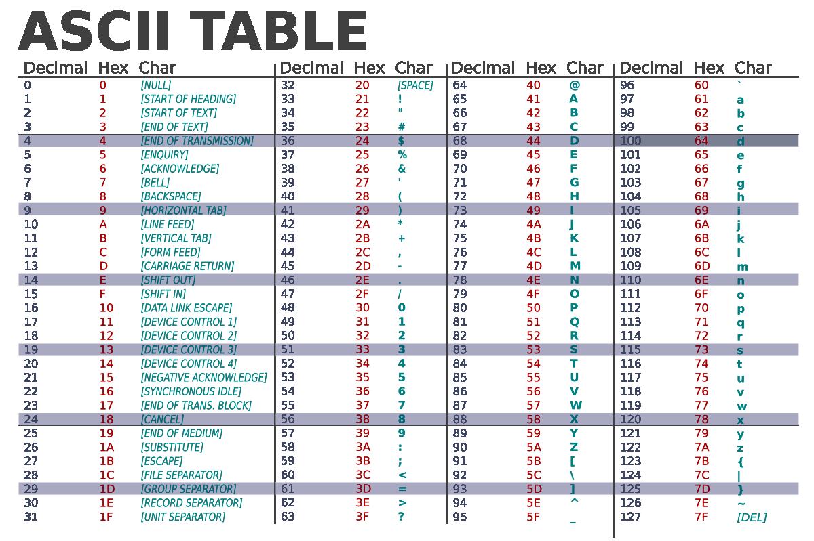

# Caractere
Caracteres são representados pelo tipo `char`, que também representa o menor tipo inteiro.

Isso acontece pois caracteres são representados por códigos númericos, que indicam diferentes caracteres.

A implementação mais comum e adotada é o padrão ASCII, que estabelece um padrão para caracteres utilizando os código númericos de 0 a 127 para representar 128 caracteres diferentes.

Abaixo uma imagem representando a tabela ASCII:




Exemplo de código utilizando caracteres : 
```c
#include <stdio.h>

int main() {
    char test = 'A';
    putchar(test); //Escreve o caractere 'A'
}
```

## Sequências de escape
Podemos escrever caracteres utilizando sequências de escape que começam com `\`.

Sendo elas:

- `\a` : Alerta, geralmente toca um beep quando escrito (Bell 0x7)
- `\b` : Backspace, usado para apagar uma tecla (0x8)
- `\f` : Usado para quebra de página, mantendo a mesma posição horizontal mas em uma nova linha (Form Feed 0xC)
- `\n` : Escreve uma nova linha (LF ou line feed 0xA)
- `\r` : Volta o cursor para o início da linha (CR ou Carriage Return 0xD), além disso o padrão de nova linha do windows é `\r\n`
- `\t` : Equivalente ao "tab", insere espaços para formatação (0x9)
- `\v` : Tab vertical (0xB)
- `\'` : Usado para digitar o caractere `'` pois ele é normalmente usado para literais de caractere
- `\"` : Usado para digitar o caractere `"` pois ele é normalmente usado para literais de string
- `\\` : Usado para digitar o caractere `\` pois ele é usado para sequências de escape
- `\ ooo`: Usado para digitar um cactere em uma string, indicando uma sequência no sistema númerico octal, `ooo` deve ser números de `0` a `8`
- `\x hh`: Usado para digitar um caractere ASCII, diretamente no seu valor em hexadecimal, `hh` deve ser 2 digitos hexadecimais.
- `\x hhhh`: Usado para digitar um caractere Unicode, diretamente no seu valor em hexadecimal, `hhhh` deve ser 4 digitos hexadecimais.

## Tipos adicionais de caracteres
Existem outros tipos adicionais de caracteres, sendo eles : 
- `wchar_t`: Tipo de caractere "largo" definido pela plataforma, no geral é utilizado para caracteres em UTF-16 no windows e UTF-32 no linux/macOs.
- `char8_t`: Utilizado para guardar caracteres em UTF-8 e é o mesmo tipo efetivo de `unsigned char` (adicionado no `C23`).
- `char16_t`: Utilizado para guardar caracteres que ocupam até 16bits (adicionado no `C11`).
- `char32_t`: Utilizado para guardar caracteres que ocupam até 32bits (adicionado no `C11`).

Estes tipos ajudam também a especificar a intenção do código, pois seria possível usar tipos de inteiros para guardar os códigos de caracteres que são maiores ou mesmo usar `unsigned char` diretamente para caracteres UTF-8.

Já o tipo `wchar_t` é especialmente útil no Windows, que internamente usa UTF-16 e exige em muitos casos, uso de strings neste padrão, como `wchar_t` foi incluido antes mesmo do `C11`, é possível usar versões mais antigas do C com ele.

## Literais de caractere
Para escrever caracteres, podemos utilizar : 
```c
 'A'  //Literal de caractere
L'B'  //Literal de caractere do tipo wchar_t
u'C'  //Literal de caractere do tipo char16_t (adicionado no C11)
U'💻' //Literal de caractere do tipo char32_t (adicionado no C11)

u8'D' //Literal de caractere em UTF-8 (adicionado no C23)
```

Também é possível escrever literais para múltiplos caracteres, mas o valor efetivo é definido pela implementação.

- Literais de múltiplos caracteres como `'AB'` tem tipo `int`.
- Literais largos de múltiplos caracteres como `L'AB'` tem tipo `wchar_t`.
- Os especificadores `u` e `U` geralmente não devem ser usados para literais de múltiplos caracteres, pois não são suportados em compiladores como clang e seu suporte foi totalmente removido no `C23`.

Apesar de literais de múltiplos caracteres serem definidos por implementação, a maioria dos compiladores, exceto o MSVC (compilador da microsoft),  implementa como um valor em big endian alinhado para direita, de forma que `\1` seja `0x00000001` e `\1\2\3\4` seja `0x01020304`.

Literais de múltiplos caracteres são comumente utilizados para definir números "mágicos" usados no início de arquivos para identificar unicamente seu tipo, por exemplo imagens em PNG começam com `%PNG`, Zips com `PK`, BMPs com `BMP`.