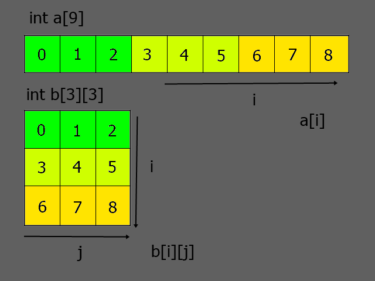

# Arrays
Arrays (ou vetores), são tipos que consistem em uma sequência, contínua na memória, de valores de um mesmo tipo. Usar arrays é uma forma de garantir que todos os seus elementos são sequenciais na memória.

Essa garantia também vem com uma grande vantagem, a possibilidade de acessar qualquer elemento do array ao utilizar um número inteiro que indicando a posição a ser acessada.

Tal número inteiro utilizado para indicar uma posição ou elemento no array é normalmente chamado de índice.

## Declaração de arrays 

A declaração de arrays é similar a de tipos primitivos, porém com a adição de `[TAMANHO]`, onde `TAMANHO` é um número inteiro indicando o tamanho do array.

O acesso aos elementos do array, que se da pelo operador `[]`, sempre inicia pelo índice `0` até o índice `TAMANHO-1`, considerando que `TAMANHO` foi o valor usado para declarar o array.

Exemplo : 

```c
    int valores[10];  //Array com 10 elementos
    valores[0] = 10;  //Primeiro elemento
    valores[9] = 100; //Último elemento

    //(o tamanho é 10, então ele só vai de 0 a 9)
    valores[10] = 50; //ERRADO! Não façam isso em casa!! 
```

Vale lembrar que o índice usado para acessar o array pode ser qualquer expressão que resulte em um número inteiro, incluindo variáveis e funções, sendo normalmente utilizados em conjunto com laços de repetição.

O exemplo abaixo demonstra um cálculo do quadrado de vários números em um laço de repetição com array : 

```c
    int quadradosPerfeitos[10] = {1,2,3,4,5,6,7,8,9,10};

    for(int i = 0; i < 10; i++)
        quadradosPerfeitos[i] *= quadradosPerfeitos[i];

    //Quadrados perfeitos agora tem {1,4,9,16,25,36,49,64,81,100}
```

Quando escrevemos o nome do array sozinho, sem o operador `[]`, teremos efetivamente um endereço do ínicio do array, similar ao uso de `&variavel` com outros tipos.

Também é importante mencionar que o operador de atribuição `=` não pode ser usado diretamente no array após sua declaração, de forma que `array = array2` seja inválido, enquanto `array[0] = array2[0]` é válido.

Quando utilizamos o operador `sizeof` em arrays teremos o tamanho total do array considerando a soma total do tamanho de todos elementos.

Entrando em mais detalhes, existem 3 variações de arrays : arrays de tamanho constante, arrays de tamanho variável ou arrays de tamanho desconhecido.

## Arrays de tamanho constante
Arrays são considerados como arrays de tamanho constante quando são inicializados com uma expressão de inteiro constante (definições de preprocessador, `sizeof`, `constexpr` ou `enum`) e seu tipo não inclui um array de tamanho variável.

Exemplo com várias formas de definir tamanhos de array : 

```c
#define TAM_ARRAY 10

enum { 
    TAM_ARRAY2 = 20
};

constexpr int TAM_ARRAY3 = 30; //C23 apenas

int main() {
    const int TAM_ARRAY4 = 40;

    int arr1[TAM_ARRAY];      //Array de tamanho constante
    int arr2[TAM_ARRAY2];     //Array de tamanho constante
    int arr3[TAM_ARRAY3];     //Array de tamanho constante
    int arr4[TAM_ARRAY4];     //Array de tamanho variável 
                              //(consts não são expressões constantes)
    int arr5[8*sizeof(char)]; //Array de tamanho constante
}
```
 
Arrays de tamanho constante também podem ser inicializados com blocos, geralmente utilizando chaves `{}`, nesses casos o tamanho do array pode ser omitido, pois ele pode ser deduzido pela quantidade de elementos.

Existem alguns casos particulares onde arrays podem ser inicializados a partir de strings, desde que o tipo do array seja compatível com o da string.

Se houver uma inicialização, sempre que um elemento não for especificado, o valor padrão colocado nele será `0`, portanto é normal utilizar `{0}` para inicializar todos elementos como zero.

```c
    //Inicializa com os 5 elementos já preenchidos
    int arr1[5] = {1,2,3,4,5};

    //arr2 tem efetivamente tamanho 10
    int arr2[] = {1,2,3,4,5,6,7,8,9,10};

    //str começa com 'a','b','c','\0' e tem tamanho 40
    char str[40] = "abc";

    //Tem tamanho 5 ('a','b','c','d','\0')
    char str2[] = "abcd";
    
    //Também tem tamanho 5
    wchar_t str3[] = L"abcd";

    //Nesse caso, todos os 400 elementos são zero
    int arr3[400] = {0};
```

> Em alguns lugares podemos ver o uso de `{}` para inicializar todos elementos para 0.
>
> Essa forma de escrita só foi adicionada no `C23`, mas está desde muito antes no C++ e é suportado pelo GCC
> como uma extensão de compilador, o ideal é utilizar sempre `{0}` para garantir uma maior compatibilidade.

Desde o `C99` é possível também utilizar inicializadores designados para inicializar alguns elementos de posições especificas de um array.

Esse tipo de inicialização é particularmente útil quando combinado com enumerações, ou quando queremos pular a inicialização de valores ou inicializar os elementos de um array fora de ordem.

Exemplo usando inicializadores designados para vincular elementos de um enum a um array.
```c
#define ICON_PATH "/usr/config/icons"

//Calcula o tamanho de um array
#define ARRAY_SIZE(X) (sizeof(X)/sizeof(*X))

//Causa um problema de compilação se a condição for verdadeira
#define BUILD_BUG_ON(condition) ((void)sizeof(char[1 - 2*!!(condition)]))

enum ProgramIcons{
    PROGRAM_MAIN_ICON,
    PROGRAM_CONFIG_ICON,
    PROGRAM_FILE_ICON,
    PROGRAM_DELETE_ICON,

    /* Adicionar novos elementos acima */
    PROGRAM_ICON_AMOUNT
};

//Array com o caminho do arquivo de cada icone da lista
const char *iconPath[] = {
    [PROGRAM_MAIN_ICON]   = ICON_PATH "/main.png",
    [PROGRAM_CONFIG_ICON] = ICON_PATH "/cfg.png",
    [PROGRAM_FILE_ICON]   = ICON_PATH "/fileico.png",
    [PROGRAM_DELETE_ICON] = ICON_PATH "/deleteico.png"
};

int main()
{
    //Macros que causam problema ao compilar quando o tamanho do array
    //não bate com o enum
    BUILD_BUG_ON(PROGRAM_ICON_AMOUNT != ARRAY_SIZE(iconPath));
}
``` 

## Arrays de tamanho variável
Desde o `C99`, quando inicializamos um array com um valor que não é uma expressão constante como por exemplo com valores de variáveis temos a criação de um array de tamanho variável.

Os arrays de tamanho variável normalmente são chamados de VLA, uma sigla do seu nome em inglês "Variable Length Array".

Eles funcionam de forma similar a variáveis locais com o modificador `const`, o tamanho do array é sempre redefinido ao executar a linha que o declara porém seu tamanho não muda no período entre sua criação e destruição.

Assim como arrays de tamanho constante, arrays de tamanho variável também não podem ter tamanho 0, portanto é importante sempre checar e evitar que o número utilizado para inicializar ele seja um número inteiro com valor maior ou igual a 1.

O operador `sizeof` funciona em arrays de tamanho variável e gera um tamanho correto para o array, porém os valores gerados não são constantes de compilação.


Exemplo da criação de um array de tamanho variável : 
```c
#include <stdlib.h>
#include <stdio.h>

int lerNumero()
{
    char linha[1024];
    fgets(linha, sizeof(linha), stdin);
    return (int)strtol(linha, NULL, 10);
}

int main()
{
    const int n = lerNumero();

    if(n > 100) {
        puts("O número informado é muito grande!");
        return 1;
    }

    int array[n]; //Criação de um VLA com n elementos
    printf("Array tem %zu bytes no total\n", sizeof(array));
}
```

Arrays de tamanho variável não podem ter duração `estática`, pois ela normalmente indica que o valor é pre-alocado durante a inicialização do programa, e como é impossível saber antecipadamente o tamanho, isso não pode ser feito.

Eles também não podem ter vinculação `externa`, de forma que VLAs só possam existir dentro de funções.

Desde o `C11` um compilador pode definir `__STDC_NO_VLA__` para `1` de forma a indicar que VLA e tipos derivados de VLA não sejam suportados.

## Arrays de tamanho desconhecido
Arrays de tamanho desconhecido são declarado ao não especificar um tamanho nem um inicializador, utilizando apenas `[]`, são considerados pela linguagem como um "tipo incompleto".

Tipos incompletos são tipos onde não há informação suficiente para saber o tamanho efetivo e que podem ser eventualmente completados ao fornecer uma declaração com tamanho.

No caso de arrays, eles podem ser acessados, mas utilizar o operador `sizeof` resulta em erro, pois o tamanho do array não é conhecido.

## Arrays como parâmetros de função
Ao serem colocados como argumentos de função, arrays, na verdade, "decaem" para ponteiros.

Mas o que quer dizer "decair" neste caso? Bom, eles efetivamente se tornam parâmetros equivalentes a ponteiros, logo utilizar o operador `sizeof` resulta no tamanho de um ponteiro e não no tamanho do array, o que pode ser um tanto confuso para iniciantes na linguagem.

Dessa forma, quando repassamos um array, não temos uma cópia do array e sim uma referência que acessa diretamente ele, permitindo também que ele seja modificado diretamente.

```c
    //Essa definição
    int funcao(int parametro[10]);

    //É equivalente a 
    int funcao(int *parametro);

    int fun2(int param[10]) 
    {
        printf("%zu\n", sizeof(param)); //Equivalente a sizeof(int*)
    }

    int main()
    {
        int a[10];
        printf("%zu\n", sizeof(a)); //Equivalente a sizeof(int) * 10
    }
```

Você deve estar se perguntando "por que o C faz isso?", a resposta é que passar arrays grandes via ponteiro é muito mais eficiente do que realizar cópias dos valores, a intenção por trás da escolha é clara e bastante compreensível de um ponto de vista de performance.

Apesar de existirem alguns casos onde arrays pequenos poderiam ser copiados de forma eficiente, o decaimento para ponteiros impede isso, a resposta nestes casos é fazer uma estrutura que inclua o array, pois estruturas podem ser copiadas, mesmo se incluirem um array dentro delas.

Um uso interessante de arrays como parâmetro é quando usamos em conjunto do modificador `static`, ao utilizar o operador `static` dentro dos colchetes `[]` seguido de um tamanho, obrigamos o ponteiro recebido a ter "pelo menos" o tamanho especificado.

Ao utilizarmos `static` podemos permitir que o compilador de C realize otimizações adicionais que normalmente não seriam possíveis sem essa garantia ou gerar avisos quando passamos um array que tem tamanho menor do que o definido.

```c
    void preencheTabuada(double valor, double tabuada[static 10]) 
    {
        for(int i = 0; i < 10; i++) { 
            tabuada[i] = valor * (i + 1);
        }
    }

    int main() 
    {
        double tabuada1[10];
        double tabuada2[9];

        //Funciona normalmente
        preencheTabuada(8.0, tabuada1);

        //Errado, provavelmente vai gerar um aviso no compilador
        //ou causa comportamento indefinido
        preencheTabuada(5.0, tabuada2); 
    }
```  

## Arrays multidimensionais
Quando o tipo do elemento de um array é outro array, dizemos que este é um array multidimensional.

Chamamos de dimensões, os campos necessários para acessar um array e subscripto ou índice os números utilizados em tais campos para acessar um array.

Ao definirmos um array, podemos especificar, através de um número entre colchetes, uma das dimensões do array, a quantidade de dimensões que um array pode ter é limitada apenas pela quantidade de memória disponível.

Lembrando que não importa quantas dimensões especificarmos em um array, ele ainda será sequencial na memória, o que muda é a forma com que acessamos ele e não sua representação interna.

Num array de duas dimensões `a[3][4]`, por exemplo, teremos um número de elementos equivalente a `3 * 4`, a mesma quantidade do array `b[12]` de uma dimensão, a dimensão mais a direita é sempre a parte que é contínua na memória.

Continuando esse exemplo no código : 
```c
    int a[3][4];
    int b[12];

    //como ambos tem o mesmo número de elementos : 
    sizeof(a) == sizeof(b); //Essa expressão é verdadeira

    a[0][0]; //Acessar a[0][0] é análogo a acessar b[0]
    a[0][1]; //Acessar a[0][1] é análogo a acessar b[1]
    a[1][0]; //Acessar a[1][0] é análogo a acessar b[4]

    //Logo levando em consideração isso, podemos dizer que 
    a[x][y];

    //É equivalente a acessar
    b[4 * x + y];

    /*
      Logo, ao definirmos um array de multiplas dimensões, estamos definido um "ganho"
      para cada indice e introduzindo uma forma mais simplificada de acessar o array,
      que normalmente seria feita com cálculos mais complexos e extensos 
    */
```

De uma maneira mais visual e simples, abaixo temos uma imagem que demonstra essa equivalência de um array de uma dimensão com um de duas dimensões : 




Observe como o array `a` tem uma quantidade de elementos total equivalente ao array multidimensional `b`.

Da mesma forma, ambos são sequenciais na memória, você pode pensar nos quadrados coloridos abaixo de `a` como a "verdadeira" representação de `b` na memória, enquanto a representação abaixo de `b` como a representação lógica que estamos dando a essa memória quando a distribuimos em uma matriz.

A imagem também descreve a forma com que acessamos elementos ao usarmos indices em `a` e `b`, ao descrever quais elementos acessamos ao aumentar os valores de `i` e `j`.


### Dica ao usar arrays multidimensionais

Ao utilizarmos um array de múltiplas dimensões também é importante lembrarmos que iterar primeiro pelos indices mais a direita é mais eficiente, pois estamos efetivamente acessando a memória de maneira sequencial.

O exemplo abaixo demonstra as duas formas de acesso de uma maneira mais clara :
```c
    #define LINHAS 10
    #define COLUNAS 20

    void teste() 
    {
        int matriz[COLUNAS][LINHAS];

        //Esta forma é menos eficiente
        for(int i = 0; i < LINHAS; i++) {
            for(int j = 0; j < COLUNAS; j++) {
                matriz[j][i] = 10;
            }
        }

        //Esta forma é mais eficiente
        for(int i = 0; i < COLUNAS; i++) {
            for(int j = 0; j < LINHAS; j++) {
                matriz[i][j] = 10;
            }
        }
    }
```

### Usos de arrays multidimensionais

Utilizar um array de múltiplas dimensões geralmente é útil para representar uma variadade de coisas, alguns exemplos são : 

- Matrizes Matemáticas
- Pixels em uma tela ou imagem (posição X e Y como índices)
- Video (Número do frame, posição X e posição Y como índices)
- Tabelas (linha e coluna como índices)
- Tabuleiro de Xadrez, jogo da cobrinha (linha e coluna também)
- Traduções do programa para outras linguas (qual lingua e qual texto como índices)
- Blocos em um jogo como minecraft (posições X,Y,Z como índice)

Abaixo um exemplo de uma representação simples de um pedaço de um teclado QWERTY : 

```c
    char achaTecla(int x, int y) {
        //ç não pode ser representado com apenas um "char"
        char teclado[3][10] = {
            {'q','w','e','r','t','y','u','i','o','p'},
            {'a','s','d','f','g','h','j','k','l','?'},
            {'z','x','c','v','b','n','m',',','.',';'}
        };

        return teclado[y][x];
    }
```
