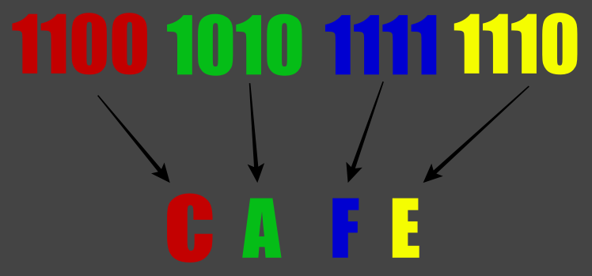

# Números Hexadecimais
No capítulo sobre [números binários](./x-01-numeros-binarios.md), já há uma explicação genérica que explica um pouco melhor sobre sistemas númericos num geral e que já da uma noção de como o sistema hexadecimal funciona.

A palavra "hexa" simboliza o número 6, enquanto "deci" simboliza o número 10, de forma que hexadecimal simbolize um sistema númerico de 16 símbolos.

Os símbolos do sistema hexadecimal são : `0`, `1`, `2`, `3`, `4`, `5`, `6`, `7`, `8`, `9`, `A`, `B`, `C`, `D`,`E`, `F`. 

Podemos também pensar que `A = 10`, `B = 11`, `C = 12`, `D = 13`, `E = 14` e `F = 15` para facilitar o entedimento, levando em consideração uma provável familiaridade maior com números decimais.

O sistema númerico hexadecimal é extremamente útil pois ele tem um número de algarismos que é uma potência de dois, que efetivamente pode representar 4 digitos binários para cada digito hexadecimal, num mundo onde um byte é geralmente 8 bits, podemos representar um byte usando dois digitos hexadecimais ao invés de 8 digitos binários.

A vantagem do hexadecimal, é que ele pode ser efetivamente utilizado como uma representação mais compacta de números binários, é por isso que dificilmente veremos programadores utilizarem números binários, pois dificilmente há qualquer vantagem de binário sobre números hexadecimais.

Devido ao uso dos caracteres de `A` até `F` é comum utilizarmos um código similar a este para conversão um número representando um digito hexadecimal para caractere : 
```c
char hex_to_char(int hex)
{
    hex = hex & 0xF; //Limita o número para 0 a 15
    return (hex >= 10) ? (hex - 10 + 'A') : (hex + '0');
}
```

## Conversão de binário para hexadecimal
A conversão de binário para hexadecimal é uma das mais fáceis, pois pode ser realizada de forma independente e paralela.

Cada 4 digitos de um número binário equivalem exatamente a um digito hexadecimal, a conversão de cada conjunto de 4 digitos pode ser feita em separado.

Isso é exemplificado na imagem abaixo, que como podem ver, leva a uma conversão extremamente simples : 


Onde o número `0b1100101011111110` vira `0xCAFE`.

É comum essa conversão ser realizada mentalmente ao convertermos o número binário de 4 digitos para decimal e depois para hexadecimal.

- `0b1100` é `12` em decimal, em hexadecimal `C = 12`, então `C`
- `0b1010` é `10` em decimal, em hexadecimal `A = 10`, então `A`
- `0b1111` é `15` em decimal, em hexadecimal `F = 15`, então `F`
- `0b1110` é `14` em decimal, em hexadecimal `E = 14`, então `E`

## Conversão de hexadecimal para binário
A conversão de hexadecimal para binário é similar a conversão reversa, podemos converter cada digito hexadecimal em 4 digitos binários.

A conversão envolve converter cada digito individualmente e depois juntar todos, removendo os espaços.

Por exemplo para conversão de `ABC` para binário teremos : 

- `A` é `0b1010` em binário (`8+2`   = `10` (decimal) = `A`)
- `B` é `0b1011` em binário (`8+2+1` = `11` (decimal) = `B`)
- `C` é `0b1100` em binário (`8+4`   = `12` (decimal) = `C`)

Logo o número resultante será a junção dos números `1010 1011 1100` (removendo os espaços), resultando em `0b101010111100`.

## Conversão de hexadecimal para decimal
Para convertermos um número em hexadecimal para decimal diretamente, podemos utilizar a `notação posicional`, seguindo as mesmas regras já explicadas no capítulo sobre [números binários](./x-01-numeros-binarios.md).


Por exemplo para convertermos `0xDC` de hexadecimal para decimal : 
```c
//A = 10, B = 11, C = 12
//D = 13, E = 14, F = 15

13 * (16^1) //13*16 = 208 
12 * (16^0) //12*1  = 12

//Logo, o resultado é
208+12 = 220
``` 

Teremos que `0xDC` em hexadecimal é o número `220` em decimal.

Para conversão do número `0xFA8` em hexadecimal para decimal, teremos : 
```c
15 * (16^2) //15 * 256 = 3840
10 * (16^1) //10 * 16  = 160
8  * (16^0) //8  * 1   = 8

//Logo, o resultado é
3840+160+8 = 4008
```

## Conversão de decimal para hexadecimal
Uma das formas é realizarmos a conversão para binário e depois convertermos de binário para hexadecimal.

Outra forma é utilizar o método da divisão, da mesma forma que utilizamos para binário.

No exemplo abaixo temos a conversão do número `3564` para hexadecimal : 
```c
3564 % 16 = 0xC (3564/16 = 222)
222  % 16 = 0xE (222/16  = 13)
13   % 16 = 0xD (13/16   = 0)

//Assim como no caso de números binários
//precisamos ler o resultado de baixo para cima
//Nesse caso ele resulta em : 
0xDEC
``` 

