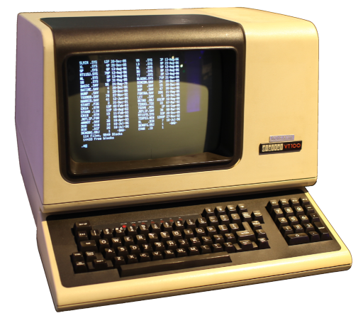
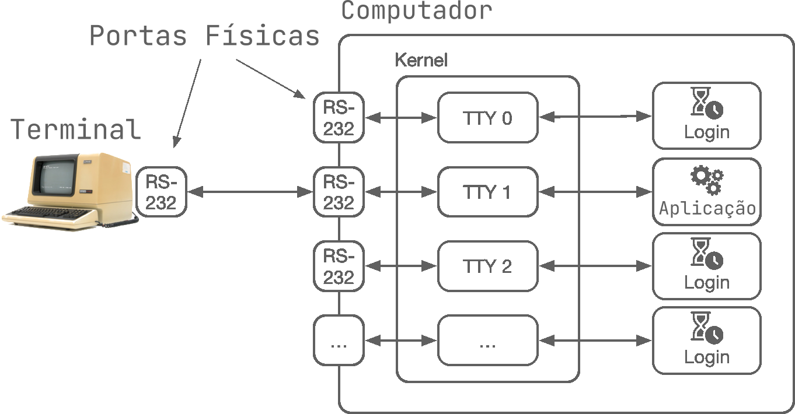
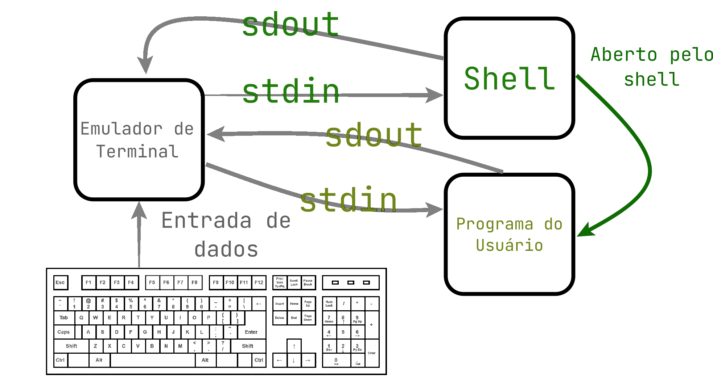

# Terminal
Um terminal de computador é um dispositivo eletrônico ou eletromecânico capaz de transcrever e receber dados de um computador. A transcrição dos dados geralmente é realizada através de um teclado.

Os primeiros "terminais" eram dispositivos com tela, capazes de transcrever caracteres digitados em um teclado e renderizar a entrada do usuário junto da resposta do computador em uma interface baseada em texto, que ainda deveriam ser conectada a um computador que fará o processamento real dos comandos.

Os terminais funcionam enviando os dados de texto digitados pelo usuário e recebendo de volta dados de texto da resposta do sistema ao qual ele está interligado, que são mostrados graficamente em seu visor.

As mensagens de terminais são históricamente finalizadas com o caractere especial `\n`, que indica uma sinalização de nova linha.

Um dos terminais mais conhecidos é o `VT-100`, demonstrado na imagem a seguir:



O `VT-100` apresenta uma interface serial, que pode ser conectada a um computador para realizar a comunicação entre eles, sistemas operacionais como o linux apresentam drivers para uso do `VT-100` que é suportado e pode ser utilizado mesmo nos dias de hoje.

No linux, é comum que terminais conectados em hardware sejam expostos como "arquivos" no caminho `/dev/ttyX`, onde `X` indica o número do terminal (o nome `tty` vem de "teletypewriter" literalmente "teletipo" em inglês).

Terminais simulados criados via software são geralmente denominados de `pty` no linux no caminho `/dev/ptyX` com `X` indicando o número do terminal, o `p` no nome simboliza a palavra "pseudo".

O diagrama a seguir demonstra a organização do kernel do linux ao conectar um terminal externo a uma aplicação dentro do sistema operacional:


## Emuladores de Terminais
Com a evolução dos computadores e o advento de sistemas operacionais mais modernos, deixou de existir a necessidade de hardwares dedicados de terminal, que foram substituidos por emuladores de terminais ou hosts de console.

Emuladores de terminais são programas que replicam o comportamento de um terminal dedicado em hardware dentro de um sistema operacional, ao fornecer um programa que lê entrada do usuário (geralmente do teclado), renderiza texto baseado na resposta do programa e na entrada do usuário e replica as mesmas funcionalidades que um terminal dedicado em hardware suportava.

Já "hosts de console" são programas que efetuam uma funcionalidade similar a um emulador de terminal, mas não o fazem com intuito de emular um hardware existente, como é o caso do processo `conhost.exe`, responsável por fornecer essa interface no Windows.

O uso de emuladores de terminal é comum em sistemas baseados em UNIX, como Linux e macOs, assim como históricamente, o Windows é conhecido por implementar um host de console, sem tentar imitar um hardware existente.

Lembrando que emuladores de terminais e hosts de console "são burros", eles só executam a tarefa de obter dados do usuário e desenhar texto na tela, limpar a tela, etc. A execução dos comandos é geralmente delegada a um software denominado de `shell`.

## Entradas e Saídas padrão
Antes de falar sobre `shell`, é importante entender o que é são as "entradas e saídas" padrão de um processo.

Desde o sistema UNIX na década de 1970, existem normalmente 3 arquivos denominados `stdin` (Entrada padrão), `stdout` (Saída padrão) e `stderr` (Saída de erro padrão).

Esses arquivos indicam de onde o programa deve ler dados, escrever e onde ele deve reportar erros que ocorreram durante sua execução.

É comum que ao abrir um programa em um sistema operacional, a `stdin` aponte para a saída de um terminal e a `stdout` aponte para a entrada de um terminal, para que `stdin` possa ler os comandos que o usuário digitou e `stdout` possa escrever no terminal.

Inclusive esses 3 arquivos podem ser "redirecionados", chamamos de redirecionamento quando modificamos o arquivo que será utilizado como entrada, saída ou saída de erros.

Com isso podemos apontar para outros arquivos, permitindo que a entrada/saída sejam utilizadas para realizar comunicação entre processos, escrever em arquivos no disco/SSD, comunicação via rede, etc.

Essa redireção normalmente é realizada ao abrir o processo, utilizando as funções [`posix_spawn`](https://man7.org/linux/man-pages/man3/posix_spawn.3.html), [`clone`](https://man7.org/linux/man-pages/man2/clone.2.html) ou [`fork`](https://man7.org/linux/man-pages/man2/fork.2.html) aliadas a [`dup2`](https://man7.org/linux/man-pages/man2/dup.2.html) no Linux ou a função [`CreateProcessW`](https://learn.microsoft.com/en-us/windows/win32/api/processthreadsapi/nf-processthreadsapi-createprocessw) no Windows.

## Shell
O `shell` é um programa que atua como uma interface ao sistema operacional, fornecendo uma forma de executar comandos e scripts.

Os primeiros programas de `shell` eram simplesmente programas que permitiam chamar outros programas e redirecionar a saída e entrada deles.

Logo o acesso a várias funcionalidades do sistema pelo terminal são normalmente delegadas a outros programas que realizam cada tarefa individualmente.  

Porém, logo percebeu-se que apenas chamar programas era um tanto limitante, para resolver essas limitações diferentes pessoas e empresas desenvolveram novos programas de `shell` que incluiam linguagens de script mais completas, que permitiam criação de variáveis, condicionais, loops, entre outras funcionalidades.

Dessa forma nasceram diferentes linguagens de script `shell`, que serão detalhadas em seguida.

A figura a seguir demonstra um diagrama da comunicação entre os programas envolvidos no processo de execução de um programa do usuário pelo terminal:


## Linguagens de script para Shell
Como mencionado anteriormente, as linguagens de script para `shell` nasceram como algo simples, que só chamava outros programas, ao longo do tempo várias novas linguagens foram desenvolvidas, sendo muitas delas extensões baseadas em linguagens anteriores, como aconteceu com o `bourne shell` que foi considerado inspiração para o desenvolvimento de shells como `bash`, `ksh`, `zsh`.

Linguagens de script conhecidas : 
- [`batch`](https://learn.microsoft.com/en-us/windows-server/administration/windows-commands/windows-commands): Utilizada como a linguagem de script convencional do windows baseado no interpretador de comandos legado do DOS, aceitando arquivos de script em `.bat`, tem suporte a variáveis, `goto`, condicionais, loops.
- [`Powershell`](https://learn.microsoft.com/en-us/powershell/): Linguagem de script avançada do Windows, com funcionalidades modernas e documentação extensa, orientada a objetos baseada na plataforma [`.NET`](https://learn.microsoft.com/en-us/dotnet/core/introduction).
- [`bash`](https://www.gnu.org/software/bash/): Shell desenvolvido pelo projeto GNU e é o shell mais comum encontrado em distruições Linux, normalmente visto como o menor denominador comum, onde outros shells são utilizados quando novas funcionalidades são desejáveis.  
- [`zsh`](https://wiki.archlinux.org/title/Zsh): Shell padrão utilizado no macOs mas também muito utilizado em distribuições Linux.
- [`ksh`](https://linux.die.net/man/1/ksh): Um shell mais antigo bastante similar ao `bash`, a maioria dos sistemas UNIX que não são Linux como Solaris e outros usam o `ksh` como padrão, enquanto no Linux é mais comum o uso do `bash`.
- [`sh`](https://pubs.opengroup.org/onlinepubs/009695399/utilities/xcu_chap02.html): É uma especificação do POSIX, normalmente servindo como atalho para o `shell` utilizado pelo sistema operacional, onde o `shell` efetivamente usado será outro, mas deve seguir as especificações, fornecendo uma interface comum similar a outras linguagens de `shell`.

### Sintaxe comum das linguagens de script Shell
Existem muitas funcionalidades em comum presentes em várias linguagens de `shell` utilizadas nos sistemas operacionais modernos, se limitar as funcionalidades mais básicas permite que um script seja facilmente adaptável em diferentes sistemas com pouco esforço.

Apesar de existirem várias diferenças, o `powershell` costuma ter uma compatibilidade maior com parte das funcionalidades mais modernas e da sintaxe do `bash` em relação ao `batch`.

#### Caminhos e navegação
No mundo UNIX, o separador de caminhos é normalmente `/`, enquanto no Windows, apesar de suportar esse separador, o separador de caminhos nativo é o `\`.

Os interpretadores de script `shell` e funções do sistema de arquivos normalmente utilizam `.` para indicar a pasta atual e `..` para indicar a pasta anterior.

O comando `cd` pode ser utilizado para modificar a pasta atual, utilizar caminhos relativos permite realizar uma "navegação em pastas" utilizando o terminal.

```bash
#Funciona em qualquer sistema
cd ..      #Volta uma pasta
cd imagens #Entra na pasta imagens

#Sistemas UNIX
cd /usr/bin #Entra na pasta /usr/bin 

#Windows
cd C:\    #Entra no disco C:\ do windows
``` 

#### Variáveis

As variáveis de ambiente do sistema normalmente podem ser acessadas como variáveis diretamente no `shell`, no `batch` uma variável pode ser acessada utilizando `%variavel%`, enquanto no `powershell`, `bash` e outros utilizando `$variavel`.

Para criar novas variáveis, podemos utilizar `$variavel = valor` no `powershell`, `bash` e afins, enquanto para o `batch` é necessário preceder o comando com a palavra chave `set` (ex: `set variavel = valor`). 

É normal que ao procurar por programas para executar com um comando, o `shell` procure em todas pastas listadas na variável de ambiente `PATH`, que indica caminhos adicionais que devem ser buscados.

#### Executar programas 
Normalmente existem 3 formas de escrever um caminho para executar um programa : 
- `programa`: Procura nas pastas da variável `PATH` e na pasta atual
- `./programa`: Procura na pasta atual utilizando um caminho relativo
- `/usr/bin/programa`: Caminho completo

(Lembrando que a `/` deve ser substituida por `\` no Windows)

Para executar um programa, é normalmente utilizada a sintaxe:
```bash
./programa argumento1 "argumento 2"
```
Onde `programa` é o caminho do programa e os argumentos da linha de comando utilizados para executar o programa são separados por espaço.

Para incluir espaços dentro do argumento, é necessário colocar o argumento entre aspas.

No `powershell`, podemos utilizar `$variavel = ./programa` para que a `variavel` receba a saída do programa (o que foi escrito na `stdout`). Enquanto que no `bash` e outros 
`shells` precisamos utilizar `$variavel = $(./programa)` para a mesma funcionalidade.

#### Redirecionar saídas e entradas

Para redirecionar saídas e entradas, podemos utilizar : 
- `>` : Redireciona a saída (`stdout`)
- `<` : Redireciona a entrada (`stdin`)
- `2>`: Redireciona a saída de erros (`stderr`)
- `&>`: Redireciona a saída normal e de erros (`stdout` e `stderr`)
- `>>`: Redireciona a saída no modo `append`, onde dados são adicionados ao fim do arquivo (`stdout`)
- `2>>`: Redireciona a saída de erros no modo `append` (`stderr`)
- `&>>`: Redireciona a saída normal e de erros no modo `append` (`stdout` e `stderr`)
- `|`: Faz com que a saída do primeiro programa (`stdout`) se torne a entrada do próximo (`stdin`)

Por exemplo, para abrir um programa que lê sua entrada de `entrada.txt` e escreve em `resposta.txt` e reporta erros em `erros.txt`:
```bash
./programa < entrada.txt > resposta.txt 2> erros.txt
```

Para utilizar `|` (denominado de pipe), para que o `programa1` tenha sua saída conectada a entrada do `programa2`:
```bash
./programa1 | ./programa2
```

#### Obtenção do código de saída

O `shell` sempre mantêm o código de saída do último programa executado em uma variável específica: 
- `batch` : Na variável `%errorlevel%`
- `bash`, `zsh` e afins: Na variável `$?` 
- `powershell` : Na variável `$LASTEXITCODE`

#### Comandos em comum 
O comando `echo` pode ser utilizado para escrever um argumento saída padrão e é suportado por todas as linguagens de `shell` (`echo a` escreve `a`).

O comando `mkdir` pode ser utilizado para criar uma pasta e `rmdir` para apagar uma pasta vazia.


Apesar de ter comandos "similares" muitos, se não a maioria deles podem funcionar de forma um pouco diferente no `powershell` em relação a sua contraparte utilizado no `bash`.

Os seguintes comandos não existem no `batch`, mas estão presentes como apelidos para outros comandos no `powershell` e como executáveis em sistemas como Linux, macOs e outros sistemas que seguem o POSIX: 
- `clear`: Limpa a tela do terminal
- `ls`: Lista todos arquivos em uma pasta
- `cat`: Escreve o conteúdo do arquivo especificado na `stdout`
- `cp`: Copia um arquivo ou pasta
- `mv`: Renomeia/move um arquivo ou pasta
- `rm`: Apaga um arquivo ou pasta
- `sleep`: Pausa o terminal por `X` segundos (`X` é o argumento númerico especificado)
- `curl`: Utilizado para realizar e testar requisições em vários protocolos de comunicação (Suportando 28 protocolos diferentes, incluindo HTTP, FTP, SMB)
- `diff`: Indica as diferença entre dois arquivos
- `man`: Exibe um manual do comando especificado no próprio terminal
- `tee`: Lê da `stdin` e escreve na `stdout` e numa lista de arquivos, o que foi lido
- `kill`: Finaliza o processo com o ID especificado

## Leitura do terminal no C
Por mais trivial e simples que pareça ser uma simples leitura do terminal, existem diversas funções diferentes que podem ser utilizadas para leitura do terminal, todas com suas próprias vantagens/desvantagens.

- [`scanf`](https://en.cppreference.com/w/c/io/fscanf): Extremamente simples de utilizar e já realiza conversões de forma fácil, boa para casos onde a entrada sempre respeita um formato fixo e tamanho esperado, mas péssima para leitura de entrada do usuário, pela dificuldade ou impossibilidade de tratar erros e facilidade de causar problemas de segurança.
- [`fgets`](https://en.cppreference.com/w/c/io/fgets): Melhor função para leitura de linhas que é padrão do C, inclui o caractere de nova linha no texto obtido, limitando para que seja escrito no máximo `tamanho-1` de forma que o último caractere escrito seja o `\0`, seu único defeito é que essa função não reporta o tamanho da string e nem quando um caractere de nova linha não foi encontrado, sendo necessário chamar `strlen` e checar manualmente.
- [`GNU readline`](https://www.man7.org/linux/man-pages/man3/readline.3.html): Na biblioteca padrão do Linux do grupo GNU, a `glibc`, existe uma função chamada `readline` que retorna a string lida alocada dinamicamente, que depois deve ser liberada com `free`, a função também oferece capacidade de utilizar edição de linha e histórico de comandos.
- [`GNU getline`](https://man7.org/linux/man-pages/man3/getline.3.html): Também uma extensão do GNU na `glibc`, recebe um buffer pre-alocado do usuário com `malloc` e o expande internamente utilizando `realloc` caso necessário, não apresenta as funcionalidades extras de histórico e edição da `readline`.
- [`ReadConsoleW`](https://learn.microsoft.com/en-us/windows/console/readconsole): Função específica do Windows para leitura de terminal, lê strings em UTF-16 independente das configurações de locale do usuário, é a forma recomendada de ler do terminal no Windows, essa função também reporta o número de bytes lidos e inclui `\r\n` (o terminador de nova linha do Windows) no buffer.

Nos casos onde deseja-se ler valores que não são strings, como inteiros e ponto flutuantes, saiba que o terminal sempre entrega os valores em texto, o ideal é utilizar funções como `strtol`, `strtof`, `strtod` ou até mesmo `sscanf`, inclusive a maioria das linguagens de alto nível seguem o padrão de leitura + conversão que difere do padrão encontrado em `scanf`.

Ao realizar esse guia, investigamos o código fonte do [`CPython`](https://github.com/python/cpython) e [`.NET Core`](https://github.com/dotnet/runtime) usado e desenvolvido em C# para fins comparativos.

O `CPython` utiliza a função `ReadConsoleW` no Windows, `readline` do GNU no Linux e `fgets` em outros lugares.

O `.NET Core` utiliza a função `ReadConsoleW` no Windows e lê diretamente utilizando funções nativas como `open` e `read` nos sistemas UNIX (como Linux, macOs e afins). A diferença é que a leitura é bufferizada e depois extraida caractere por caractere para preencher a string retornada ao usuário por funções alto nível como `Console.ReadLine`.

Para isso também foi realizada uma implementação própria para leitura de linhas de um arquivo qualquer (normalmente `stdin`) utilizando como base a função `fgetc` e outra com `fgets`:
<details>
  <summary>Clique para Expandir/Retrair</summary>

```c
enum readline_result{
    READLINE_OK,            //A linha foi lida com sucesso
    READLINE_PENDING_CHARS, //Não há espaço para a string inteira
    READLINE_EOF,           //Final do arquivo foi atingido
    READLINE_FILE_ERR,      //Erro no arquivo
    READLINE_INVALID_PARAM, //Parâmetro inválido
};

/**
 * @brief Lê uma linha do arquivo especificado sem incluir o caractere de nova linha
 * @param buffer Buffer onde os dados serão escritos
 * @param size Ponteiro para tamanho do buffer na entrada, bytes lidos na saída
 * @param file Arquivo do qual será lido (geralmente stdin)
 * @return Resultado da função, indicando erro ou leitura completa
 */
enum readline_result my_readline(char *buffer, size_t *size, FILE *file)
{
    enum readline_result result = READLINE_PENDING_CHARS; 
                                                          
    if(buffer == NULL || size == NULL || *size == 0)
        return READLINE_INVALID_PARAM;

    char *basebuf = buffer;
    char *endbuf  = buffer + *size;
    for(;buffer < endbuf; buffer++) {
        int c = fgetc(file);
        if(c == EOF || c == '\n') {
            result = (c == '\n')  ? READLINE_OK :
                     (feof(file)) ? READLINE_EOF 
                                  : READLINE_FILE_ERR;
            break;
        }
        *buffer = (char)c;
    }
    *buffer  = '\0';
    *size    = (buffer - basebuf); 
    return result;
}

//Versão de `fgets` seguindo o padrão
enum readline_result fgets_readline(char *buffer, size_t *size, FILE *file)
{
    if(buffer == NULL || size == NULL)
        return READLINE_INVALID_PARAM;

    char *result = fgets(buffer, *size, file);
    unsigned char had_newline = 0;
    if(result != NULL) {
        *size = strlen(buffer);
        //Remove o "\n"
        had_newline = (buffer[*size-1] == '\n');
        buffer[*size-1] = '\0';
        *size--;
    } else {
        *size = 0;
    }
    
    if(feof(file))
        return READLINE_EOF;

    if(result == NULL) 
        return ferror(file) ? READLINE_FILE_ERR : READLINE_INVALID_PARAM;   
    else 
        return had_newline ? READLINE_OK : READLINE_PENDING_CHARS;
}
```
Essas funções repassam todos possíveis casos de erro como retorno da função além do tamanho, lidando propriamente com todos os casos problemáticos, a ideia de utilizar `fgetc` foi parcialmente inspirada pelo código fonte do `.NET Core`.
</details>

## Sequências de Escape VT-100
O terminal `VT-100` e seus sucessores apresentavam funções extras usando as chamadas sequências de escape.

Se olharmos na tabela ASCII, veremos que o código `0x1B` (27), é utilizado para representar o "escape", que normalmente sinaliza o início de um comando especial.

Ao enviar um comando de sequência de escape pela `stdout`, um programa pode sinalizar ao terminal uma ação especial.

Utilizando as extensões de sistemas operacionais modernos em conjunto com as sequências de escape do VT-100 é possível : 
- Posicionar o cursor
- Alterar visibilidade do cursor
- Alterar formato do cursor
- Modificar o scroll do terminal
- Inserir/remover linhas e caracteres ou limpar a tela
- Mudar a cor do texto e do fundo
- Obter informações do terminal como a posição do cursor

No Windows, as sequências de terminal `VT-100` só foram adotadas recentemente, desde o Windows 10, pois antes era necessário chamar várias funções para manipular propriedades específicas do terminal, a própria Microsoft aconselha que essas sequências sejam utilizadas em código moderno para garantir uma compatibilidade maior com sistemas baseados em UNIX como Linux e macOs.

Muitos cursos de C ensinam a limpar a tela do terminal utilizando `system("cls")`, este comando só funciona no Windows e ainda é extremamente ineficiente, pois a função `system` abre um novo processo do `shell` para executar o comando e espera até que ele finalize.

Utilizar as sequências de escape garante uma compatibilidade com mais sistemas operacionais, maior performance, além de permitir que os comandos sejam embarcados em arquivos e acionados ao escrevê-los no terminal. 

Para utilizar a maioria das sequências de escape suportadas no Windows, Linux e macOs, podemos utilizar uma biblioteca própria feita pelo autor deste guia denominada <a href="./libs/vt100.h" download>vt100.h</a>.

Para limpar a tela de forma similar a `system("cls")`, utilize a macro `VT100_CLEAR_SEQUENCE`, que realiza as 3 ações de mover o cursor, limpar a tela atual e o scroll.